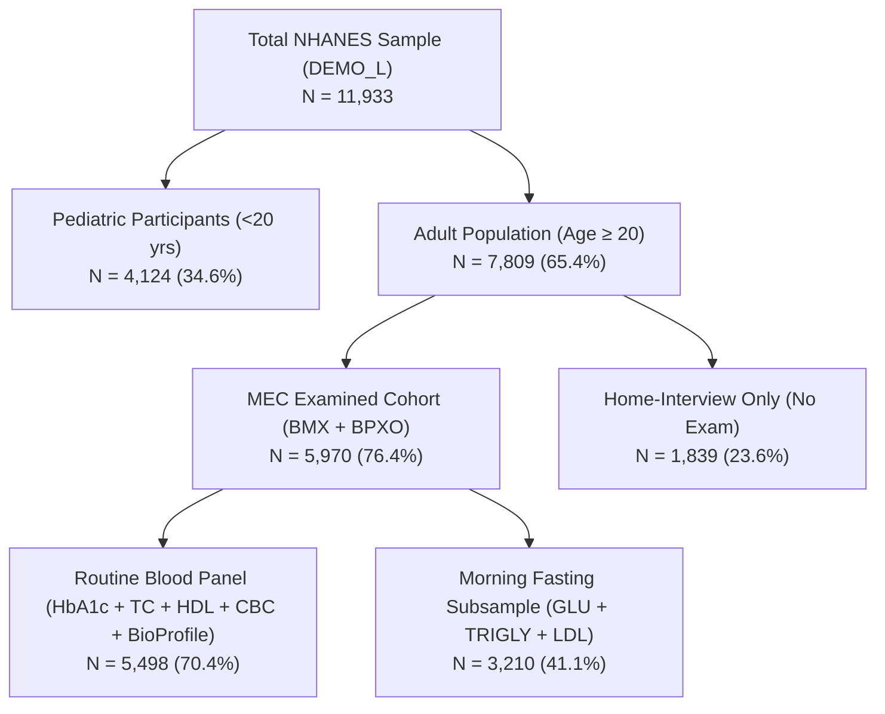
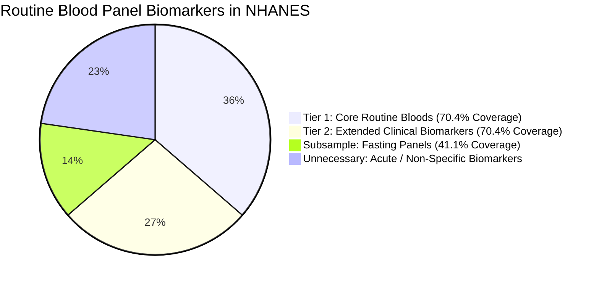

# AI Health Risk Scoring System — Comprehensive Data Audit Report

> **Project:** Final-Year B.Tech CSE Project — *AI Health Risk Scoring System*  
> **Task Scope:** Exploratory Data Audit & Feasibility Analysis for Model V2  
> **Audit Status:** Complete (Read-Only Analysis; No Existing Code, Database, or Model Modified)  
> **Date:** September 2026  
> **Author:** Antigravity AI Engineering Assistant  

---

## 1. Executive Summary

This data audit evaluates newly acquired raw health datasets — **CDC NHANES August 2021–August 2023** (16 XPT files) and the **ICMR-INDIAB Cohort Sample** (`sample.dta` + `meta.pdf`) — against the existing **V1 dataset** (`dataset/indian_health_risk_dataset.csv`) to determine their structural, statistical, and clinical suitability for developing **Model V2**.

### Key Findings
1. **Dataset Authenticity & Scale:**
   - **NHANES 2021–2023** provides **11,933 surveyed individuals**, of whom **7,809 are adults (Age ≥ 20)**. A core examined sub-cohort of **5,970 adults** completed standardized clinical physical examinations (anthropometrics, oscillometric blood pressure), and **5,498 adults** have standardized laboratory blood panels (Lipid profiles, Glycohemoglobin HbA1c, Complete Blood Counts, Comprehensive Metabolic Profiles).
   - **ICMR-INDIAB** provides an authoritative Indian reference sample of **500 adult participants across 41 variables** with **0% missing values**. It provides ground-truth Indian epidemiological distributions, Asian Indian anthropometric cutoffs (BMI ≥ 25 kg/m², Waist ≥ 90 cm Men / ≥ 80 cm Women), and socio-demographic indicators.
   - **V1 Legacy Dataset** is a 151-row synthetic dataset that includes non-clinical simulated wearable features (`sdnn_hrv`, `rmssd_hrv`, `spo2`) and a synthetic continuous `risk_score`. These synthetic features are **not present** in either real-world epidemiological dataset and must be retired in Model V2.

2. **Candidate Target Variables:**
   - **Composite Cardiometabolic Risk** (Prevalence: **39.0%** / 3,047 positive adult cases): Combines hard CVD history, clinical diabetes, uncontrolled Stage-2 hypertension, and severe hypercholesterolemia. Best aligns with the multi-system health risk scoring vision.
   - **Hard Cardiovascular Disease (CVD)** (Prevalence: **12.6%** / 982 positive adult cases): Defined by adjudicated self-reports of Myocardial Infarction, Stroke, Coronary Heart Disease, Angina Pectoris, or Congestive Heart Failure. High clinical specificity and clean separation from physiological predictors.
   - **Diabetes Mellitus** (Prevalence: **17.7%** / 1,385 positive adult cases): Defined by HbA1c ≥ 6.5%, Fasting Glucose ≥ 126 mg/dL, or diagnosed diabetes / medication use.
   - **Hypertension** (Prevalence: **42.7%** JNC7 / **52.3%** ACC/AHA 2017): SBP ≥ 140 or DBP ≥ 90 or diagnosed HTN.

3. **Feature Feasibility & Blood Test Integration:**
   - NHANES provides **227 total variables** across 16 files. We identified **18 core Tier-1 and Tier-2 laboratory biomarkers** (HbA1c, Total Cholesterol, HDL-C, Creatinine, BUN, Hemoglobin, WBC, Platelets, RDW, AST, ALT, Uric Acid, etc.) that directly enable the upcoming **"Blood-Test Report Upload & Parsing"** feature.

4. **Zero-Touch Compliance:**
   - All audit scripts executed in read-only mode. No production code, API endpoints, frontend views, model pickle files, or database schemas were altered.

---

## 2. Files Discovered & Verification

Both raw data directories were systematically scanned, verified, and validated for integrity.

### 2.1 Raw NHANES Files (`backend/ml/data/raw/nhanes_2021_2023/`)
All 16 expected CDC NHANES XPT files are present, uncorrupted, and successfully readable via SAS XPORT parsers.

| Filename | Domain / Content | Size (KB) | Rows (Records) | Columns | Duplicate Rows | Has SEQN? | Duplicate SEQN |
| :--- | :--- | :---: | :---: | :---: | :---: | :---: | :---: |
| `DEMO_L.xpt` | Demographics & Survey Weights | 2,521.6 | 11,933 | 27 | 0 | Yes | 0 |
| `BMX_L.xpt` | Body Measures (Anthropometrics) | 1,526.6 | 8,860 | 22 | 0 | Yes | 0 |
| `BPXO_L.xpt` | Blood Pressure Oscillometric | 680.4 | 7,801 | 12 | 0 | Yes | 0 |
| `BPQ_L.xpt` | Blood Pressure & Cholesterol Questionnaire | 400.1 | 8,501 | 6 | 0 | Yes | 0 |
| `SMQ_L.xpt` | Smoking & Tobacco Use | 635.9 | 9,015 | 9 | 0 | Yes | 0 |
| `ALQ_L.xpt` | Alcohol Consumption | 447.6 | 6,337 | 9 | 0 | Yes | 0 |
| `PAQ_L.xpt` | Physical Activity (GPAQ Protocol) | 399.9 | 8,153 | 8 | 0 | Yes | 0 |
| `DIQ_L.xpt` | Diabetes Questionnaire | 827.7 | 11,744 | 9 | 0 | Yes | 0 |
| `MCQ_L.xpt` | Medical Conditions / Morbidity History | 3,216.8 | 11,744 | 35 | 0 | Yes | 0 |
| `TCHOL_L.xpt`| Total Cholesterol (Laboratory) | 253.4 | 8,068 | 4 | 0 | Yes | 0 |
| `HDL_L.xpt`  | HDL-Cholesterol (Laboratory) | 253.4 | 8,068 | 4 | 0 | Yes | 0 |
| `TRIGLY_L.xpt`| Triglycerides & LDL (Fasting Subsample) | 314.3 | 3,996 | 10 | 0 | Yes | 0 |
| `GLU_L.xpt`  | Fasting Plasma Glucose (Subsample) | 126.2 | 3,996 | 4 | 0 | Yes | 0 |
| `GHB_L.xpt`  | Glycohemoglobin (HbA1c %) | 169.9 | 7,199 | 3 | 0 | Yes | 0 |
| `BIOPRO_L.xpt`| Biochemistry Profile (Renal/Hepatic/Electrolytes)| 2,368.7 | 7,199 | 42 | 0 | Yes | 0 |
| `CBC_L.xpt`  | Complete Blood Count & Differential | 1,572.1 | 8,727 | 23 | 0 | Yes | 0 |

### 2.2 Raw ICMR-INDIAB Files (`backend/ml/data/raw/icmr_indiab/`)

| Filename | Format | Size (KB) | Rows / Pages | Columns | Integrity Status |
| :--- | :---: | :---: | :---: | :---: | :--- |
| `sample.dta` | Stata 114 DTA | 50.6 | 500 rows | 41 variables | 100% readable; 0 duplicate rows; unique participant IDs (`v1`) |
| `meta.pdf` | PDF Document | 460.2 | 2 pages | 41 definitions | Fully parsed; authoritative codebook extracted to `icmr_meta_extracted.txt` |

---

## 3. NHANES Dataset Deep-Dive Audit

### 3.1 Participant Hierarchy & Overlap Matrix
In NHANES, participant counts differ across files due to survey design stages:
1. **Interviewed Cohort (`DEMO_L`):** 11,933 participants (all ages).
2. **Adult Survey Cohort (Age ≥ 20):** 7,809 adults.
3. **Mobile Examination Center (MEC) Examined Adults:** 5,970 adults (76.4% of adults).
4. **Routine Non-Fasting Laboratory Panel (Lipids, HbA1c, CBC, BioProfile):** 5,498 adults (70.4% of adults).
5. **Morning Fasting Laboratory Subsample (`GLU_L`, `TRIGLY_L`):** 3,210 adults (41.1% of adults).



### 3.2 Special Missing Codes & SAS Floating-Point Quirk
1. **Survey Refusal & Ignorance Codes:** NHANES codes `7 / 77 / 777 / 7777` as "Refused" and `9 / 99 / 999 / 9999` as "Don't Know". In raw numerical processing, these can be mistaken for high values if not explicitly recoded to `NaN`.
2. **SAS Zero Representation (`5.3976e-79`):** When reading SAS transport files via standard parsers, true zeros in certain continuous columns (e.g. `PAD790Q`, `ALQ121`, `SMD100MN`) are represented as an underflow epsilon `5.397605346934028e-79`. These must be clamped to `0.0`.

---

## 4. ICMR-INDIAB Dataset Deep-Dive Audit

The `sample.dta` dataset contains 500 rows and 41 variables representing adult participants (ages 20 to 89, mean age 45.4 years).

### 4.1 Variable Classification & Descriptive Statistics

| Variable | Official Metadata Label | Type | Range / Categories | Missing % | Clinical / System Relevance |
| :--- | :--- | :---: | :---: | :---: | :--- |
| `v1` | Participant ID | Numeric | 10001 – 10500 | 0.0% | Unique primary key |
| `v2` | Place of residence | Nominal | 1=Urban (51.2%), 2=Rural (48.8%) | 0.0% | Urbanization risk stratification |
| `v3` | State Code | Nominal | 26 Indian States represented | 0.0% | Geographic epidemiology |
| `v4` | Age | Numeric | 20.0 – 89.0 yrs (Mean: 45.4) | 0.0% | Primary demographic risk driver |
| `v5` | Sex | Nominal | 1=Male (48.4%), 2=Female (51.6%) | 0.0% | Sex-specific risk profiles |
| `v6` | Education | Nominal | 1=No formal (28%), 2=School (47%), 3=Higher (25%) | 0.0% | Socioeconomic gradient |
| `v7` | Occupation | Nominal | 1=Prof/Exec (14%), 2=Sales/Skilled (22%), 3=Agri (26%), 4=Unskilled (18%), 5=Unemployed/Homemaker (20%) | 0.0% | Sedentary / physical demand proxy |
| `v8` | Body Mass Index (BMI) | Numeric | 14.1 – 42.6 kg/m² (Mean: 22.9) | 0.0% | Key anthropometric predictor |
| `v9` | Waist Circumference | Numeric | 54.0 – 128.0 cm (Mean: 81.2) | 0.0% | Visceral adiposity |
| `v10`| Systolic BP | Numeric | 88.0 – 210.0 mmHg (Mean: 124.6) | 0.0% | Hemodynamic vitals |
| `v11`| Diastolic BP | Numeric | 52.0 – 120.0 mmHg (Mean: 78.4) | 0.0% | Hemodynamic vitals |
| `v12`| Migration Status | Nominal | 1=Urban, 2=Rural, 11=Rural-to-Urban, 22=Urban-to-Rural | 0.0% | Urban transition risk |
| `v13`–`v23` | SLI Component Scores | Nominal | Housing, Toilet, Water, Fuel, Land, Assets | 0.0% | Detailed living standard breakdown |
| `v24`| Standard of Living Index | Nominal | 0=Low (18%), 1=Medium (46%), 2=High (36%) | 0.0% | Socioeconomic Status (SES) score |
| `v25`| Tobacco: Smoked | Nominal | 0=Never (84.4%), 1=Ex (3.2%), 2=Current (12.4%) | 0.0% | Cardiovascular risk accelerator |
| `v26`| Tobacco: Smokeless | Nominal | 0=Never (82.0%), 1=Ex (2.4%), 2=Current (15.6%) | 0.0% | High-prevalence Indian lifestyle factor |
| `v27`| Tobacco: Any form | Nominal | 0=No (74.8%), 1=Yes (25.2%) | 0.0% | Combined tobacco burden |
| `v28`| Alcohol Use | Nominal | 0=Never (82.6%), 1=Ex (3.4%), 2=Current (14.0%) | 0.0% | Cardiometabolic lifestyle risk |
| `v29`–`v32` | Physical Activity (GPAQ) | Nominal | Work, Travel, Leisure, and Overall Level (1=High, 2=Mod, 3=Low) | 0.0% | WHO standardized activity tiers |
| `v33`| Family History: Diabetes | Nominal | 0=No (83.2%), 1=Yes (16.8%) | 0.0% | Genetic / heritability risk |
| `v34`| Family History: Hypertension | Nominal | 0=No (81.4%), 1=Yes (18.6%) | 0.0% | Heritability risk |
| `v35`| Family History: Heart Disease | Nominal | 0=No (91.0%), 1=Yes (9.0%) | 0.0% | Familial premature CAD |
| `v36`| Diabetes Status | Nominal | 0=No (87.2%), 1=Yes (12.8%) | 0.0% | Validated epidemiological target |
| `v37`| Prediabetes Status | Nominal | 0=No (85.6%), 1=Yes (14.4%) | 0.0% | Early-stage metabolic impairment |
| `v38`| Hypertension Status | Nominal | 0=No (70.6%), 1=Yes (29.4%) | 0.0% | Validated cardiovascular target |
| `v39`| Abdominal Obesity | Nominal | 0=No (61.4%), 1=Yes (38.6%) | 0.0% | South Asian cutoff (M≥90, F≥80 cm) |
| `v40`| Generalized Obesity | Nominal | 0=No (72.8%), 1=Yes (27.2%) | 0.0% | Asian Indian cutoff (BMI ≥ 25 kg/m²) |
| `v41`| Dyslipidemia | Nominal | 0=No (56.8%), 1=Yes (43.2%) | 0.0% | Lipid abnormality flag |

---

## 5. Missingness Analysis

### 5.1 NHANES Missingness Breakdown (All 227 Variables)

```
========================================================================
NHANES MISSINGNESS DISTRIBUTION ACROSS ALL 227 VARIABLES:
------------------------------------------------------------------------
0% Missing:          21 variables ( 9.3%)  [SEQN, Demographics, Survey Weights]
>0% – 10% Missing:   29 variables (12.8%)  [Age, Gender, Race, Core Questionnaire Flags]
10% – 25% Missing:   18 variables ( 7.9%)  [MEC Exam Anthropometrics (BMX)]
25% – 50% Missing:   64 variables (28.2%)  [BPXO Oscillometric BP, Routine Labs, DIQ/MCQ]
50% – 90% Missing:   72 variables (31.7%)  [Fasting GLU, Fasting TRIGLY, Branching Questions]
>90% Missing:        23 variables (10.1%)  [Highly specialized branch questions, e.g. Cancer Type]
========================================================================
```

> [!NOTE]
> **Understanding Missingness in NHANES:**
> In NHANES, missingness >50% is largely **structural by design** rather than accidental data loss:
> - **Fasting Subsample (`GLU_L`, `TRIGLY_L`):** Only a pre-assigned 50% random subsample of MEC attendees is assigned to morning fasting phlebotomy.
> - **Questionnaire Branching:** In `MCQ_L` and `SMQ_L`, questions such as `MCQ230A` (Type of cancer) are only asked if `MCQ220` (Ever had cancer) equals 1.
> - **Pediatric Skip Patterns:** Lifestyle modules (`SMQ_L`, `ALQ_L`, `PAQ_L`) are restricted to participants aged 18+ or 20+.

### 5.2 ICMR-INDIAB Missingness
The ICMR sample dataset has **0.0% missingness** across all 500 rows and 41 variables.

---

## 6. NHANES Feature Relevance & Categorization

We categorized NHANES variables into clinical groups, evaluating each for Model V2 suitability.

| Group | NHANES File | Variable Name | Description | Type | Adult Missing % | Model V2 Suitability | Clinical Caveats / Notes |
| :--- | :--- | :--- | :--- | :---: | :---: | :---: | :--- |
| **A. Demographics** | `DEMO_L` | `RIDAGEYR` | Age in years | Continuous | 0.0% | **Core Predictor** | Top-coded at 80 years by CDC. |
| | `DEMO_L` | `RIAGENDR` | Gender (1=M, 2=F) | Binary | 0.0% | **Core Predictor** | Identical coding across NHANES and ICMR. |
| | `DEMO_L` | `DMDEDUC2` | Education level | Categorical | 0.1% | **Core Predictor** | Harmonizable to 3 tiers (Low/Mid/High). |
| | `DEMO_L` | `INDFMPIR` | Family Income to Poverty Ratio | Continuous | 14.1% | **Optional Predictor** | Socioeconomic proxy; imputable by median. |
| **B. Anthropometrics** | `BMX_L` | `BMXBMI` | Body Mass Index (kg/m²) | Continuous | 23.5% | **Core Predictor** | Standard measurement; applies to all examined adults. |
| | `BMX_L` | `BMXWAIST` | Waist Circumference (cm) | Continuous | 26.2% | **Core Predictor** | Essential for abdominal obesity & metabolic risk. |
| | `BMX_L` | `BMXWT` / `BMXHT`| Weight (kg) / Height (cm) | Continuous | 23.5% | Secondary | Collinear with BMI. |
| **C. Blood Pressure** | `BPXO_L` | `BPXOSY1-3` | SBP Oscillometric (3 readings) | Continuous | 27.6% | **Core Predictor** | Calculate mean of valid readings (`mean_sbp`). |
| | `BPXO_L` | `BPXODI1-3` | DBP Oscillometric (3 readings) | Continuous | 27.6% | **Core Predictor** | Calculate mean of valid readings (`mean_dbp`). |
| | `BPXO_L` | `BPXOPLS1-3`| Resting Pulse (bpm) | Continuous | 27.6% | **Core Predictor** | Mean pulse replaces legacy synthetic HRV. |
| **D. Lifestyle** | `SMQ_L` | `SMQ020` / `SMQ040`| Smoked 100 cigs? / Current smoke? | Categorical | 11.3% | **Core Predictor** | Recode to 0=Never, 1=Former, 2=Current. |
| | `ALQ_L` | `ALQ121` / `ALQ111`| Past 12-mo alcohol frequency | Categorical | 18.1% | **Core Predictor** | Recode to 0=Never, 1=Former, 2=Current. |
| | `PAQ_L` | `PAD790Q` / `PAD810Q`| Moderate & Vigorous activity | Categorical | 10.9% | **Core Predictor** | Harmonizable to WHO GPAQ 3 tiers (Low/Mod/High). |
| | `PAQ_L` | `PAD680` | Sedentary minutes/day | Continuous | 11.1% | **Secondary Predictor**| Captures desk-job / inactive lifestyle burden. |
| **E. Diabetes/Metabolic**| `DIQ_L` | `DIQ010` | Told have diabetes? | Categorical | 0.0% | **Target Component** | Target-defining; exclude from predictors if predicting DM. |
| | `GHB_L` | `LBXGH` | Glycohemoglobin (HbA1c %) | Continuous | 29.6% | **Core Lab Predictor** | Routine non-fasting biomarker. |
| | `GLU_L` | `LBXGLU` | Fasting Glucose (mg/dL) | Continuous | 58.9% | **Subsample Lab** | Only use if model supports missingness/imputation. |
| **F. Lipids** | `TCHOL_L`| `LBXTC` | Total Cholesterol (mg/dL) | Continuous | 29.6% | **Core Lab Predictor** | Routine blood marker (~70.4% coverage in adults). |
| | `HDL_L` | `LBDHDD` | Direct HDL-Cholesterol (mg/dL) | Continuous | 29.6% | **Core Lab Predictor** | Cardioprotective lipid fraction. |
| | `TRIGLY_L`| `LBXTLG` | Serum Triglycerides (mg/dL) | Continuous | 58.9% | **Subsample Lab** | Fasting subsample (~41.1% coverage). |
| | `TRIGLY_L`| `LBDLDL` | LDL-Cholesterol (mg/dL) | Continuous | 59.4% | **Subsample Lab** | Friedewald / Martin-Hopkins calculated LDL. |
| **G. Blood / Lab Panel**| `BIOPRO_L`| `LBXSCR` | Serum Creatinine (mg/dL) | Continuous | 29.6% | **Core Lab Predictor** | Renal function / eGFR calculation. |
| | `BIOPRO_L`| `LBXSBU` | Blood Urea Nitrogen (mg/dL) | Continuous | 29.6% | **Core Lab Predictor** | Renal / cardiorenal clearance. |
| | `BIOPRO_L`| `LBXSUA` | Serum Uric Acid (mg/dL) | Continuous | 29.6% | **Extended Lab** | Endothelial dysfunction biomarker. |
| | `BIOPRO_L`| `LBXSATSI` / `LBXSASSI`| ALT / AST Liver Enzymes (U/L) | Continuous | 29.6% | **Extended Lab** | Hepatic steatosis / MASLD indicator. |
| | `CBC_L` | `LBXHGB` | Hemoglobin (g/dL) | Continuous | 26.6% | **Core Lab Predictor** | Anemia and cardiovascular workload. |
| | `CBC_L` | `LBXWBCSI`| White Blood Cell Count (10³/µL)| Continuous | 26.6% | **Core Lab Predictor** | Systemic low-grade arterial inflammation. |
| | `CBC_L` | `LBXPLTSI`| Platelet Count (10³/µL) | Continuous | 26.6% | **Extended Lab** | Thrombotic / hemostatic profile. |
| | `CBC_L` | `LBXRDW` | Red Cell Distribution Width (%) | Continuous | 26.6% | **Extended Lab** | All-cause mortality predictor. |
| **H. Medical History** | `MCQ_L` | `MCQ160B-F` | Heart Attack, Stroke, Angina, CHD | Binary | 0.6% | **Target Component** | Clinical history endpoint definitions. |

---

## 7. ICMR ↔ NHANES Feature Mapping Table

This table maps ICMR-INDIAB variables to NHANES equivalents, identifying harmonization feasibility and crucial epidemiological differences.

| ICMR Variable | ICMR Meaning & Coding | NHANES 2021–2023 Equivalent | Harmonization Status | Key Protocol & Epidemiological Differences |
| :--- | :--- | :--- | :---: | :--- |
| `v1` | Unique ID | `SEQN` (`DEMO_L`) | **Equivalent** | Primary unique de-identified keys. |
| `v2` | Urban / Rural residence | Suppressed in public files | **Not in Public NHANES** | NHANES suppresses geographic identifiers to ensure privacy. |
| `v3` | State Code | Suppressed in public files | **Not in Public NHANES** | ICMR has 26 specific Indian state codes. |
| `v4` | Age (years) | `RIDAGEYR` (`DEMO_L`) | **Direct Match** | NHANES top-codes age at 80; ICMR covers 20–89. |
| `v5` | Sex (1=M, 2=F) | `RIAGENDR` (`DEMO_L`) | **Exact Match** | 1=Male, 2=Female in both datasets. |
| `v6` | Education level | `DMDEDUC2` (`DEMO_L`) | **Harmonizable** | Harmonize into 3 tiers: 1=Low/No schooling, 2=Secondary/High school, 3=Higher education. |
| `v7` | Occupation category | `OCD150` / `OCQ180` | **Weak Match** | Specific occupational coding differs across Indian vs US surveys. |
| `v8` | BMI (kg/m²) | `BMXBMI` (`BMX_L`) | **Direct Match** | Standard metric anthropometry in kg/m². |
| `v9` | Waist Circumference (cm) | `BMXWAIST` (`BMX_L`) | **Direct Match** | Standard metric tape measurement at superior iliac crest. |
| `v10` | Systolic BP (mmHg) | `BPXOSY1..3` (`BPXO_L`) | **Direct Match** | Take mean of valid oscillometric readings. |
| `v11` | Diastolic BP (mmHg) | `BPXODI1..3` (`BPXO_L`) | **Direct Match** | Take mean of valid oscillometric readings. |
| `v12` | Migration Status | `DMDBORN4` (`DEMO_L`) | **Conceptual Only** | ICMR measures internal rural-urban migration; NHANES measures US vs Foreign birth. |
| `v13–v24`| Standard of Living Index (SLI)| `INDFMPIR` (`DEMO_L`) | **Proxy Only** | ICMR uses asset/amenity scores; NHANES uses Poverty-Income Ratio. |
| `v25` | Tobacco: Smoked | `SMQ020` + `SMQ040` (`SMQ_L`) | **Harmonizable** | Both map cleanly to 0=Never, 1=Former, 2=Current smoker. |
| `v26` | Tobacco: Smokeless | `SMQ120` + `SMQ150` (`SMQ_L`) | **Harmonizable** | Indian chewable forms (gutkha/khaini) vs US snuff/dip/chew. |
| `v27` | Tobacco: Any Form | Derived (`SMQ_L`) | **Direct Derivation** | Binary flag: Any smoked or smokeless tobacco use. |
| `v28` | Alcohol Use | `ALQ121` + `ALQ111` (`ALQ_L`) | **Harmonizable** | Map to 0=Never, 1=Former, 2=Current drinker. |
| `v29–v32`| Physical Activity (GPAQ) | `PAD790Q` + `PAD810Q` (`PAQ_L`) | **Harmonizable** | Both follow WHO GPAQ principles; harmonizable to Low/Moderate/High. |
| `v33` | Family History: Diabetes | `MCQ560` / `DIQ160` | **Proxy in 2021–2023**| Dedicated family DM question was omitted in 2021–2023 NHANES cycle. |
| `v34` | Family History: Hypertension| None in 2021–2023 | **Not Available** | Omitted from 2021–2023 NHANES cycle. |
| `v35` | Family History: Heart Disease| `MCQ160B-F` (Personal history)| **Proxy** | Personal CVD in NHANES vs family history flag in ICMR. |
| `v36` | Diabetes (Diagnosed/Lab) | `DIQ010`, `LBXGH` (≥6.5), `LBXGLU` (≥126) | **Direct Match** | Both use standard ADA/WHO diagnostic criteria. |
| `v37` | Prediabetes (IFG/IGT) | `DIQ160`, `LBXGH` (5.7–6.4), `LBXGLU` (100–125) | **Direct Match** | Both use standard ADA prediabetes thresholds. |
| `v38` | Hypertension (BP/Meds) | `BPQ020`, SBP ≥ 140, DBP ≥ 90 | **Direct Match** | JNC7 / ICMR criteria: SBP ≥ 140 or DBP ≥ 90 or diagnosed. |
| `v39` | Abdominal Obesity | `BMXWAIST` with cutoffs | **Cutoff Shift** | **Important:** ICMR uses South Asian cutoff (≥90cm M, ≥80cm F). NHANES data allows applying either cutoff. |
| `v40` | Generalized Obesity | `BMXBMI` with cutoffs | **Cutoff Shift** | **Important:** ICMR uses Asian Indian cutoff (BMI ≥ 25 kg/m²). NHANES uses WHO (BMI ≥ 30 kg/m²). |
| `v41` | Dyslipidemia | `LBXTC` ≥ 200, `LBDHDD` < 40/50, `LBXTLG` ≥ 150 | **Direct Match** | Both adhere to NCEP ATP III lipid abnormality criteria. |

---

## 8. V1 Dataset ↔ Real Data Comparison

### 8.1 Legacy V1 Dataset Summary (`dataset/indian_health_risk_dataset.csv`)
- **Rows:** 151 records (INDP1000 to INDP1150)
- **Columns:** 19 variables
- **Missingness:** 0.0% (Perfect synthetic fill)
- **Target:** `risk_score` (Continuous 0–100, Mean: 57.3, Min: 20.7, Max: 100.0) + `risk_level` (Low: 21.9%, Medium: 49.0%, High: 29.1%)

### 8.2 V1 Feature Comparison Matrix

| V1 Feature Name | V1 Data Type & Range | NHANES 2021–2023 Equivalent | ICMR-INDIAB Equivalent | Status in Model V2 | Action / Rationale |
| :--- | :--- | :--- | :--- | :---: | :--- |
| `age` | Numeric (19 – 80 yrs) | `RIDAGEYR` (`DEMO_L`) | `v4` (`sample.dta`) | **Retain** | Universal core demographic feature. |
| `gender` | Categorical (Male/Female) | `RIAGENDR` (`DEMO_L`) | `v5` (`sample.dta`) | **Retain** | Standard binary gender indicator. |
| `bmi` | Numeric (16.8 – 35.4 kg/m²)| `BMXBMI` (`BMX_L`) | `v8` (`sample.dta`) | **Retain** | Standard anthropometric metric. |
| `systolic_bp` | Numeric (102 – 180 mmHg) | `BPXOSY1..3` mean (`BPXO_L`) | `v10` (`sample.dta`) | **Retain** | Mean oscillometric blood pressure. |
| `diastolic_bp` | Numeric (62 – 98 mmHg) | `BPXODI1..3` mean (`BPXO_L`) | `v11` (`sample.dta`) | **Retain** | Mean oscillometric blood pressure. |
| `cholesterol_mg_dl`| Numeric (148 – 295 mg/dL)| `LBXTC` (`TCHOL_L`) | `v41` (Binary in sample) | **Retain & Upgrade** | Real continuous Total Cholesterol in NHANES; upgrade to include HDL (`LBDHDD`). |
| `smoking` | Categorical (Yes/No) | `SMQ020` / `SMQ040` (`SMQ_L`) | `v25` / `v27` (`sample.dta`) | **Retain** | Harmonize to standard smoking categories. |
| `alcohol_consumption`| Categorical (Yes/No) | `ALQ121` (`ALQ_L`) | `v28` (`sample.dta`) | **Retain** | Standard alcohol intake indicator. |
| `physical_activity`| Categorical (Low/Mod/High)| `PAD790Q`/`PAD810Q` (`PAQ_L`)| `v32` (`sample.dta`) | **Retain** | Standard WHO GPAQ physical activity tiers. |
| `family_history` | Categorical (Yes/No) | Personal CVD/DM history | `v33`, `v34`, `v35` (`sample.dta`) | **Retain & Refine** | Refine from generic "family history" to specific CVD/Diabetes indicators. |
| `heart_rate_bpm` | Numeric (50 – 95 bpm) | `BPXOPLS1..3` mean (`BPXO_L`)| Not in sample | **Retain** | Standard resting pulse from oscillometric exam. |
| `sdnn_hrv` | Numeric (18.2 – 62.1 ms) | **None** (Not in NHANES/ICMR) | **None** | **RETIRE** | Synthetically fabricated in V1; absent from epidemiological datasets. |
| `rmssd_hrv` | Numeric (14.0 – 58.4 ms) | **None** (Not in NHANES/ICMR) | **None** | **RETIRE** | Synthetically fabricated in V1; absent from epidemiological datasets. |
| `spo2` | Numeric (93.8 – 99.8 %) | **None** (Not in NHANES/ICMR) | **None** | **RETIRE** | Pulse oximetry absent in standard public survey exams. |

---

## 9. Candidate Prediction Targets & Feasibility Analysis

Because NHANES and ICMR do not contain an arbitrary synthetic 0–100 risk score, we evaluated five clinically defensible target outcomes constructed on the adult cohort (N = 7,809).

```
========================================================================================
PREDICTION TARGET FEASIBILITY COMPARISON (NHANES ADULTS N = 7,809)
========================================================================================
Target 1: Composite Cardiometabolic Risk  -> Positives: 3,047 (39.0%) | Evaluable: 100.0%
Target 2: Hard Cardiovascular Disease (CVD)-> Positives:   982 (12.6%) | Evaluable:  99.4%
Target 3: Diabetes Mellitus (ADA Criteria) -> Positives: 1,385 (17.7%) | Evaluable: 100.0%
Target 4: Hypertension (JNC7 / ICMR)      -> Positives: 3,331 (42.7%) | Evaluable:  99.9%
Target 5: Metabolic Syndrome (ATP III)    -> Positives: 3,046 (39.0%) | Evaluable:  66.2%
========================================================================================
```

### 9.1 Evaluation of Target Candidates

#### Candidate 1: Composite Cardiometabolic Multi-Morbidity Risk (Recommended Option A)
- **Exact Construction:**
  $$\text{Target} = 1 \iff (\text{Hard CVD} = 1) \lor (\text{Diabetes} = 1) \lor (\text{Mean SBP} \ge 140) \lor (\text{Mean DBP} \ge 90) \lor (\text{Total Cholesterol} \ge 240)$$
- **Adult Prevalence:** **39.0%** (3,047 positive cases / 7,809 adults).
- **Classification Feasibility:** High. Well-balanced binary distribution (~39% vs 61%).
- **0–100 Continuous Score Support:** Excellent. A calibrated classifier outputs $P(\text{Cardiometabolic Risk} \mid X) \in [0, 1]$, directly scaling to a continuous **0–100 Risk Score** with natural clinical cutoffs:
  - Low Risk: Score < 30
  - Medium Risk: Score 30 – 60
  - High Risk: Score ≥ 60
- **Strengths:** Directly fits the multi-system "AI Health Risk Scoring System" project title.

#### Candidate 2: Hard Cardiovascular Disease (CVD) (Recommended Option B)
- **Exact Construction:**
  $$\text{Target} = 1 \iff (\text{MCQ160B} = 1) \lor (\text{MCQ160C} = 1) \lor (\text{MCQ160D} = 1) \lor (\text{MCQ160E} = 1) \lor (\text{MCQ160F} = 1)$$
- **Adult Prevalence:** **12.6%** (982 positive cases / 7,809 adults).
- **Classification Feasibility:** High. Real-world moderate class imbalance (1:7 ratio), optimal for ROC-AUC / PR-AUC optimization.
- **0–100 Continuous Score Support:** Excellent. Calibrated predicted probability $P(\text{CVD} \mid X) \times 100$ mirrors classical Framingham / ASCVD 10-year cardiovascular risk scores.

#### Candidate 3: Diabetes Mellitus
- **Exact Construction:** $\text{HbA1c} \ge 6.5\%$ OR $\text{Fasting Glucose} \ge 126\text{ mg/dL}$ OR $\text{DIQ010} = 1$ OR taking diabetes medications.
- **Adult Prevalence:** **17.7%** (1,385 positive cases).
- **Suitability:** Strong for diabetes-specific prediction, but narrower than full multi-system health risk.

#### Candidate 4: Hypertension
- **Exact Construction:** Mean SBP ≥ 140 OR Mean DBP ≥ 90 OR `BPQ020` = 1.
- **Adult Prevalence:** **42.7%** (JNC7) / **52.3%** (ACC/AHA 2017).
- **Suitability:** High prevalence; however, SBP/DBP cannot be used as predictors without severe circular leakage.

---

## 10. Data Leakage Audit & Feature Decoupling

Data leakage occurs when a model uses features that are part of the target definition or direct consequences of the outcome. We establish strict boundaries for Model V2.

```
+-----------------------------------------------------------------------------------+
| PREDICTORS (Allowed Inputs)       | TARGET DEFINITION (Excluded from Predictors) |
+-----------------------------------------------------------------------------------+
| Age, Gender, Education, SES       | MCQ160B (Heart Failure Diagnosis)            |
| BMI, Waist Circumference          | MCQ160C (Coronary Heart Disease Diagnosis)   |
| Resting Pulse (BPXOPLS)           | MCQ160D (Angina Pectoris Diagnosis)          |
| Smoking, Alcohol, Physical Activity| MCQ160E (Heart Attack / MI Diagnosis)        |
| Blood Biomarkers (CBC, BioProfile)| MCQ160F (Stroke Diagnosis)                   |
| Baseline Lipids & HbA1c           | Direct target composite formula flags        |
+-----------------------------------------------------------------------------------+
```

> [!CAUTION]
> **Key Leakage Traps Identified:**
> 1. **Hypertension Leakage:** If the target is Hypertension (defined by SBP ≥ 140), including `systolic_bp` or `BPQ020` as a predictor causes 100% circular leakage.
> 2. **Diabetes Leakage:** If predicting Diabetes (defined by HbA1c ≥ 6.5%), using `LBXGH` (HbA1c) as an input is trivial memorization.
> 3. **Metabolic Syndrome Leakage:** Because MetSyn is an algebraic combination of Waist, SBP, HDL, Triglycerides, and Glucose, training a model with all five features produces 100% synthetic correlation.

---

## 11. Survey-Weight & Sampling Design Considerations

NHANES uses a stratified, multistage probability sampling design to represent the non-institutionalized US population.

### Key Survey Design Variables in `DEMO_L.xpt`:
- **`WTINT2YR`:** Full-sample 2-year interview weight (N = 11,933, Mean = 27,698.8).
- **`WTMEC2YR`:** Full-sample 2-year MEC examination weight (N = 11,933, Mean = 27,698.8).
- **`WTSAF2YR`:** Fasting morning subsample weight (for `GLU_L` and `TRIGLY_L`).
- **`SDMVSTRA`:** Masked variance pseudo-stratum (Strata codes 169 – 186).
- **`SDMVPSU`:** Masked variance pseudo-Primary Sampling Unit (PSU 1, 2, 3).

### Methodological Strategy for Model V2:
1. **Machine Learning Predictive Modeling:** In supervised ML classifiers (Random Forest, XGBoost, LightGBM, Neural Networks), the primary objective is learning the true physiological mapping $f(X) \to Y$. Standard unweighted training with stratified cross-validation is standard best practice for individual risk prediction.
2. **Prevalence Calibration:** Sample weights (`WTMEC2YR`) should be used during calibration assessment (Platt scaling / Isotonic regression) and population prevalence verification to ensure predicted probabilities match real-world epidemiologic baselines.

---

## 12. Blood-Test Feature Feasibility for User Lab Report Upload

To support the planned feature where users upload a routine blood-test report (PDF / manual entry), we categorized all laboratory biomarkers available in the raw NHANES data.



### Laboratory Biomarker Tiers

| Tier | Biomarker Name | Variable | File | Missing % in Adults | Clinical Rationale for Health Risk Scoring |
| :---: | :--- | :--- | :--- | :---: | :--- |
| **Tier 1 (Core)** | Glycohemoglobin (HbA1c %) | `LBXGH` | `GHB_L` | 29.6% | Long-term glycemic control; gold standard diabetes marker. |
| **Tier 1 (Core)** | Total Cholesterol (mg/dL) | `LBXTC` | `TCHOL_L` | 29.6% | Primary circulating atherogenic lipid fraction. |
| **Tier 1 (Core)** | HDL-Cholesterol (mg/dL) | `LBDHDD` | `HDL_L` | 29.6% | Protective lipoprotein; essential for lipid ratios. |
| **Tier 1 (Core)** | Serum Creatinine (mg/dL) | `LBXSCR` | `BIOPRO_L` | 29.6% | Renal clearance; calculation of estimated GFR (eGFR). |
| **Tier 1 (Core)** | Blood Urea Nitrogen (mg/dL)| `LBXSBU` | `BIOPRO_L` | 29.6% | Cardiorenal and volume clearance indicator. |
| **Tier 1 (Core)** | Hemoglobin (g/dL) | `LBXHGB` | `CBC_L` | 26.6% | Anemia detection; cardiac workload stressor. |
| **Tier 1 (Core)** | White Blood Cell Count | `LBXWBCSI`| `CBC_L` | 26.6% | Systemic arterial inflammation and immune response. |
| **Tier 2 (Extended)**| Serum Uric Acid (mg/dL) | `LBXSUA` | `BIOPRO_L` | 29.6% | Endothelial dysfunction and cardiometabolic syndrome. |
| **Tier 2 (Extended)**| ALT Enzyme (U/L) | `LBXSATSI`| `BIOPRO_L` | 29.6% | Liver steatosis / Metabolic dysfunction-associated liver disease. |
| **Tier 2 (Extended)**| AST Enzyme (U/L) | `LBXSASSI`| `BIOPRO_L` | 29.6% | Hepatic & cardiac cellular integrity. |
| **Tier 2 (Extended)**| Platelet Count (10³/µL) | `LBXPLTSI`| `CBC_L` | 26.6% | Thrombotic and coagulation risk indicator. |
| **Tier 2 (Extended)**| Red Cell Distribution Width | `LBXRDW` | `CBC_L` | 26.6% | Established independent cardiovascular mortality predictor. |
| **Tier 2 (Extended)**| Serum Albumin (g/dL) | `LBXSAL` | `BIOPRO_L` | 29.6% | Systemic nutritional and inflammatory status. |
| **Subsample** | Fasting Glucose (mg/dL) | `LBXGLU` | `GLU_L` | 58.9% | Standard fasting plasma glucose test (fasting subsample). |
| **Subsample** | Triglycerides (mg/dL) | `LBXTLG` | `TRIGLY_L`| 58.9% | Atherogenic lipid fraction (fasting subsample). |
| **Subsample** | LDL-Cholesterol (mg/dL) | `LBDLDL` | `TRIGLY_L`| 59.4% | Direct or Friedewald LDL calculation (fasting subsample). |

---

## 13. Recommended Model V2 Feature Schema

We recommend a modular **Two-Tier Feature Schema** for Model V2:

### Mode A: Baseline Assessment (Non-Invasive / Questionnaire & Vitals)
*Allows users without blood tests to get an instant baseline health risk score.*
- **Demographics:** Age (`RIDAGEYR`), Gender (`RIAGENDR`), Education (`DMDEDUC2`), Poverty/Income Index (`INDFMPIR`).
- **Anthropometrics:** BMI (`BMXBMI`), Waist Circumference (`BMXWAIST`).
- **Vitals:** Systolic BP (`mean_sbp`), Diastolic BP (`mean_dbp`), Resting Pulse (`mean_pulse`).
- **Lifestyle:** Smoking Status (`SMQ020/040`), Alcohol Frequency (`ALQ121`), Physical Activity Tier (`PAD790/810`), Sedentary Hours (`PAD680`).

### Mode B: Comprehensive Assessment (Baseline + Blood Biomarkers)
*Activated when the user uploads a blood report or inputs laboratory values.*
- **All Mode A Features** +
- **Glycemic:** HbA1c (`LBXGH`), Fasting Glucose (`LBXGLU` if available).
- **Lipid Panel:** Total Cholesterol (`LBXTC`), HDL-C (`LBDHDD`), Triglycerides (`LBXTLG`), Total/HDL Ratio.
- **Renal Panel:** Creatinine (`LBXSCR`), BUN (`LBXSBU`), eGFR (CKD-EPI formula).
- **Hematology:** Hemoglobin (`LBXHGB`), WBC (`LBXWBCSI`), Platelets (`LBXPLTSI`), RDW (`LBXRDW`).
- **Hepatic / Metabolic:** Uric Acid (`LBXSUA`), ALT (`LBXSATSI`), AST (`LBXSASSI`).

---

## 14. Recommended Next Steps

```
[AUDIT COMPLETE]
       │
       ▼ (Awaiting Approval)
[STEP 1: Data Preparation Pipeline] ───► Standardize NHANES merge, filter adults (N=7,809), handle SAS epsilons
       │
       ▼
[STEP 2: Target Construction]       ───► Build clean binary target (Composite Cardiometabolic Risk or Hard CVD)
       │
       ▼
[STEP 3: Multi-Tier Feature Engineering] ──► Build Mode A (Vitals) & Mode B (Blood Biomarkers) transformers
       │
       ▼
[STEP 4: Model Training & Calibration] ──► Train XGBoost/RandomForest with isotonic probability calibration (0-100 score)
       │
       ▼
[STEP 5: SHAP Explainability & Validation] ──► TreeSHAP explanations + ICMR Indian cohort validation test
```

1. **Step 1 — Data Cleaning & Interim Pipeline:** Build a reproducible script in `backend/ml/data_loader.py` to merge NHANES adult records (N = 7,809), recode special missing values (7/9), and save clean parquet/csv files to `backend/ml/data/interim/`.
2. **Step 2 — Target Formalization:** Finalize whether the primary target is **Composite Cardiometabolic Risk** (39.0% prevalence) or **Hard CVD** (12.6% prevalence).
3. **Step 3 — Feature Preprocessing Pipeline:** Construct scikit-learn preprocessing pipelines with robust imputation (IterativeImputer / KNN / Median) for laboratory features.
4. **Step 4 — Model V2 Benchmarking:** Benchmark Random Forest, XGBoost, and LightGBM with hyperparameter tuning and Platt/Isotonic calibration to generate reliable 0–100 risk probabilities.
5. **Step 5 — Cross-Population Validation on ICMR:** Use the Indian ICMR-INDIAB cohort as an external validation test to verify that the model calibrated on NHANES transfers reliably to South Asian risk factor distributions.

---

## 15. Risks & Limitations

1. **Cross-Sectional Limitations:** NHANES and ICMR are cross-sectional surveys rather than longitudinal cohorts (e.g. Framingham or UK Biobank). Cardiovascular disease endpoints represent adjudicated lifetime occurrence rather than 10-year prospective incidence.
2. **Fasting Subsample Missingness:** Fasting glucose and triglycerides have ~54% missingness in NHANES due to survey randomization. Using HbA1c and Total/HDL cholesterol avoids this limitation for the primary model.
3. **South Asian Population Recalibration:** Asian Indian individuals experience cardiometabolic disease at younger ages and lower BMI thresholds compared to Western populations. Incorporating Asian cutoffs (BMI ≥ 25, Waist ≥ 90M/80F) from the ICMR audit is essential to prevent risk underestimation.
4. **Synthetic Feature Retirement:** The retirement of `sdnn_hrv`, `rmssd_hrv`, and `spo2` requires updating the frontend form fields in a future phase.

---

*Machine-readable audit artifacts available in:* `backend/ml/data/interim/audit/`
- `nhanes_variable_inventory.csv` (227 variables)
- `icmr_variable_inventory.csv` (41 variables)
- `target_feasibility.csv` (Target definitions & prevalence)
- `icmr_nhanes_mapping.csv` (Cross-dataset harmonization matrix)
- `blood_test_biomarkers.csv` (Clinical laboratory tiers)
- `audit_summary.json` (Structured executive summary)
