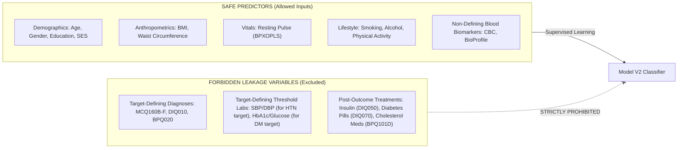
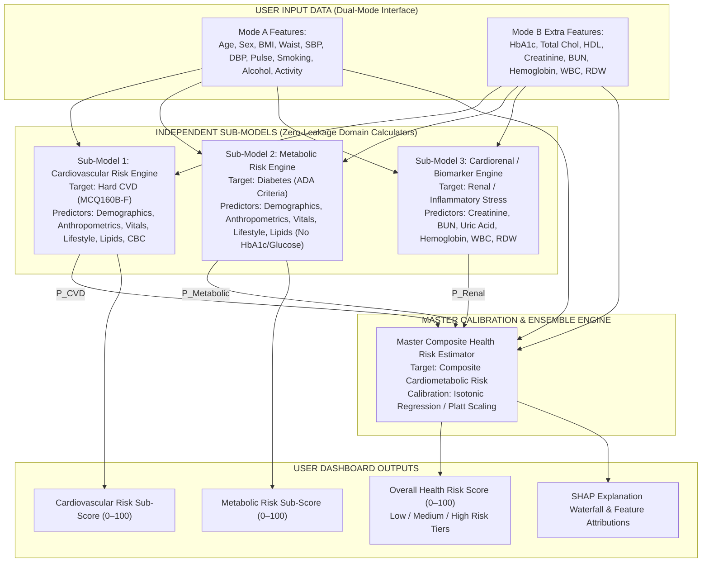
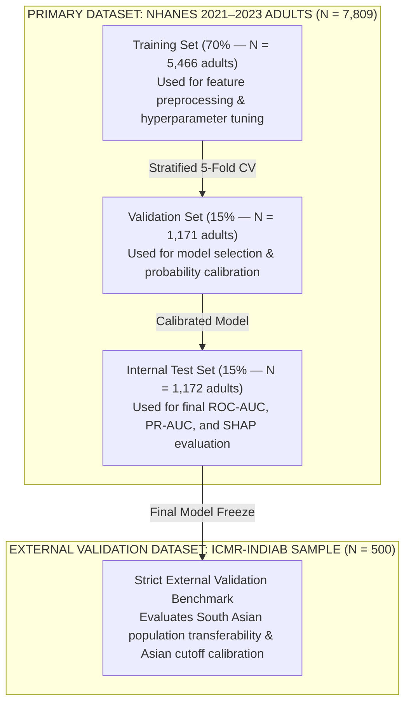

# AI Health Risk Scoring System — Model V2 Target & Feature Architecture Design

> **Document Type:** Technical Architecture Specification  
> **Stage:** Stage 1B — Target & Feature Design (Read-Only Specification)  
> **Project:** Final-Year B.Tech CSE Project — *AI Health Risk Scoring System*  
> **Primary Dataset:** CDC NHANES August 2021–August 2023 (N = 11,933 total; N = 7,809 adults)  
> **Validation Dataset:** ICMR-INDIAB Adult Cohort Sample (N = 500)  
> **Legacy Baseline:** Synthetic 151-row dataset (`dataset/indian_health_risk_dataset.csv`)  
> **Date:** September 2026  
> **Status:** Completed Design Specification — Pending User Approval  

---

## 1. Executive Summary & Project Context

This specification defines the mathematical, clinical, and architectural design for **Model V2** of the AI Health Risk Scoring System. Model V1 relied on a 151-row synthetic dataset that included fabricated wearable metrics (`sdnn_hrv`, `rmssd_hrv`, `spo2`) and a synthetic target score. Model V2 transitions the system to authentic, population-representative epidemiological datasets: **CDC NHANES 2021–2023** (16 XPT files) and the **ICMR-INDIAB cohort**.

### Core Design Principles
1. **Clinical Authenticity:** Targets and features are strictly grounded in CDC NHANES diagnostic protocols and WHO / ICMR epidemiological definitions.
2. **Zero Target Leakage:** Direct target-defining variables, post-outcome treatments, and circular proxies are strictly excluded from predictor sets.
3. **Dual-Mode Inference:** 
   - **Mode A (Baseline / Non-Invasive):** Uses questionnaire demographics, anthropometrics, vitals, and lifestyle data to provide an immediate non-invasive health risk score.
   - **Mode B (Laboratory-Enhanced):** Incorporates routine clinical blood test biomarkers to provide a comprehensive, multi-organ risk assessment.
4. **Hierarchical Multi-Model Architecture:** A decoupled multi-model architecture outputs a **Cardiovascular Risk Score**, a **Metabolic Risk Score**, and an **Overall Calibrated Health Risk Score (0–100)** without cross-target leakage.
5. **South Asian Population Recalibration:** Incorporates ICMR-INDIAB Asian Indian anthropometric cutoffs (BMI ≥ 25 kg/m², Waist ≥ 90 cm Men / ≥ 80 cm Women) to ensure accurate risk stratification for Indian users.

---

## 2. Task 1 — Comprehensive Evaluation of Target Options

We evaluated six candidate target definitions constructed on the adult cohort (**N = 7,809 adults aged 20+** in NHANES 2021–2023).

```
==================================================================================================
TARGET FEASIBILITY METRICS (NHANES ADULTS N = 7,809)
==================================================================================================
Target Option                          Positive Cases    Prevalence    Evaluable Adults    Missing %
--------------------------------------------------------------------------------------------------
A. Hard Cardiovascular Disease (CVD)      982           12.58%             7,764            0.58%
B. Diabetes Mellitus (ADA Criteria)     1,385           17.74%             7,809            0.00%
C. Hypertension (JNC7 / ICMR Criteria)  3,331           42.66%             7,800            0.12%
D. Composite Cardiometabolic Risk       3,047           39.02%             7,809            0.00%
E. Metabolic Syndrome (ATP III Criteria) 3,046           39.01%             5,171           33.78%
F. Atherosclerotic Risk (ASCVD Proxy)   1,624           20.80%             7,764            0.58%
==================================================================================================
```

### Detailed Evaluation of Each Candidate Target

#### Target A: Hard Cardiovascular Disease (CVD)
- **NHANES Target Formula:**
  $$\text{Target}_{\text{CVD}} = 1 \iff (\text{MCQ160B} = 1) \lor (\text{MCQ160C} = 1) \lor (\text{MCQ160D} = 1) \lor (\text{MCQ160E} = 1) \lor (\text{MCQ160F} = 1)$$
- **NHANES Variables Required:** `MCQ160B` (Heart Failure), `MCQ160C` (Coronary Heart Disease), `MCQ160D` (Angina Pectoris), `MCQ160E` (Heart Attack / MI), `MCQ160F` (Stroke).
- **Positive / Negative Cases:** **982 positive** vs **6,782 negative** (45 missing/refused).
- **Prevalence & Class Ratio:** **12.58%** (~1:7 imbalanced ratio).
- **Cross-Sectional vs Prospective:** Adjudicated medical history endpoint (cross-sectional lifetime prevalence in survey).
- **Clinical Interpretation:** Hard macrovascular event or clinical heart failure diagnosis.
- **0–100 Score Mapping:** Excellent. Calibrated probability $P(\text{CVD} \mid X) \times 100$ produces a smooth 0–100 cardiovascular risk score directly analogous to Framingham / ASCVD risk calculators.
- **Suitability for Project:** **High.** Highly specific, clinical, and clean separation from physiological predictors.

#### Target B: Diabetes Mellitus (ADA Diagnostic Criteria)
- **NHANES Target Formula:**
  $$\text{Target}_{\text{DM}} = 1 \iff (\text{LBXGH} \ge 6.5) \lor (\text{LBXGLU} \ge 126) \lor (\text{DIQ010} = 1) \lor (\text{DIQ050} = 1) \lor (\text{DIQ070} = 1)$$
- **NHANES Variables Required:** `LBXGH` (HbA1c %), `LBXGLU` (Fasting Glucose mg/dL), `DIQ010` (Diagnosed DM), `DIQ050` (Insulin use), `DIQ070` (Oral diabetic pills).
- **Positive / Negative Cases:** **1,385 positive** vs **6,424 negative** (0 missing; 100% evaluable).
- **Prevalence & Class Ratio:** **17.74%** (~1:4.6 ratio).
- **Clinical Interpretation:** Presence of overt type 2 or type 1 diabetes mellitus.
- **0–100 Score Mapping:** High. Probability $P(\text{Diabetes} \mid X) \times 100$ provides a continuous 0–100 diabetes risk score.
- **Suitability for Project:** **High** as a specialized metabolic sub-score; moderate as a single overall health risk score.

#### Target C: Hypertension (JNC7 / ICMR Criteria)
- **NHANES Target Formula:**
  $$\text{Target}_{\text{HTN}} = 1 \iff (\text{mean\_sbp} \ge 140) \lor (\text{mean\_dbp} \ge 90) \lor (\text{BPQ020} = 1)$$
- **NHANES Variables Required:** `BPXOSY1..3` (Systolic BP), `BPXODI1..3` (Diastolic BP), `BPQ020` (Ever told had HTN).
- **Positive / Negative Cases:** **3,331 positive** vs **4,469 negative** (9 missing).
- **Prevalence & Class Ratio:** **42.66%** (JNC7 criteria) / **52.31%** (ACC/AHA 2017 stage-1 criteria SBP ≥ 130).
- **Clinical Interpretation:** Stage-2 clinical hypertension or diagnosed blood pressure disorder.
- **0–100 Score Mapping:** Moderate. High baseline prevalence narrows discrimination bandwidth.
- **Suitability for Project:** Moderate as a sub-condition; poor as a single target due to severe leakage if SBP/DBP are included as predictors.

#### Target D: Composite Cardiometabolic Multi-Morbidity Risk (Primary Target Recommendation)
- **NHANES Target Formula:**
  $$\text{Target}_{\text{Composite}} = 1 \iff (\text{Target}_{\text{CVD}} = 1) \lor (\text{Target}_{\text{DM}} = 1) \lor (\text{mean\_sbp} \ge 140) \lor (\text{mean\_dbp} \ge 90) \lor (\text{LBXTC} \ge 240)$$
- **NHANES Variables Required:** `MCQ160B-F`, `DIQ010`, `LBXGH`, `LBXGLU`, `BPXOSY/DI`, `LBXTC`.
- **Positive / Negative Cases:** **3,047 positive** vs **4,762 negative** (0 missing).
- **Prevalence & Class Ratio:** **39.02%** (~1:1.5 ratio, balanced binary distribution).
- **Clinical Interpretation:** Holistic multi-organ cardiometabolic impairment (presence of major CVD, overt diabetes, uncontrolled stage-2 HTN, or severe hypercholesterolemia).
- **0–100 Score Mapping:** **Superior.** Calibrated probability $P(\text{Composite Risk} \mid X) \times 100$ yields a continuous, highly sensitive **0–100 Overall Health Risk Score** with natural clinical risk categories:
  - **Low Risk:** Score < 30 (Healthy / Low cardiometabolic burden)
  - **Medium Risk:** Score 30 – 60 (Moderate risk / Single controlled risk factor)
  - **High Risk:** Score ≥ 60 (High risk / Multi-morbidity or established CVD/DM)
- **Suitability for Project:** **Highest.** Perfectly matches the title and scope of "AI Health Risk Scoring System".

#### Target E: Metabolic Syndrome (ATP III / AHA Criteria)
- **NHANES Target Formula:** $\ge 3$ of 5 criteria: (1) Abdominal obesity, (2) High Triglycerides $\ge 150$, (3) Low HDL $< 40\text{M}/< 50\text{F}$, (4) High BP $\ge 130/85$, (5) High Glucose $\ge 100$.
- **Positive / Negative Cases:** **3,046 positive** vs **2,125 negative** (**2,638 missing** / unmeasured fasting labs).
- **Prevalence & Missingness:** **39.01%** prevalence, but **33.78% missingness** due to fasting subsample randomization.
- **Suitability for Project:** **Poor.** High missingness weakens model training and creates extreme circular feature leakage.

---

## 3. Task 2 — Rigorous Data Leakage Audit

Data leakage occurs when target-defining variables, downstream medical interventions, or circular proxies are erroneously included as predictors. We enforce strict separation across all candidate targets.



### Categorization Matrix of Key Variables Across Targets

| Feature Variable | Target: Hard CVD | Target: Diabetes (DM) | Target: Hypertension (HTN) | Target: Composite Risk | Leakage Status & Justification |
| :--- | :---: | :---: | :---: | :---: | :--- |
| `RIDAGEYR` (Age) | **Safe** | **Safe** | **Safe** | **Safe** | Universal baseline demographic factor. |
| `RIAGENDR` (Gender) | **Safe** | **Safe** | **Safe** | **Safe** | Universal baseline demographic factor. |
| `BMXBMI` (BMI) | **Safe** | **Safe** | **Safe** | **Safe** | Anthropometric body composition predictor. |
| `BMXWAIST` (Waist) | **Safe** | **Safe** | **Safe** | **Safe** | Visceral adiposity predictor. |
| `BPXOSY` / `BPXODI` (BP) | **Safe** | **Safe** | **DIRECT LEAKAGE** | **Safe** | Defines HTN target ($\ge 140/90$). Cannot be used to predict HTN. |
| `BPXOPLS` (Pulse) | **Safe** | **Safe** | **Safe** | **Safe** | Resting heart rate; non-defining hemodynamic metric. |
| `SMQ020` / `SMQ040` (Smoking) | **Safe** | **Safe** | **Safe** | **Safe** | Lifestyle exposure risk factor. |
| `ALQ121` (Alcohol) | **Safe** | **Safe** | **Safe** | **Safe** | Lifestyle exposure risk factor. |
| `PAD790` / `PAD810` (Activity)| **Safe** | **Safe** | **Safe** | **Safe** | Lifestyle physical activity factor. |
| `LBXGH` (HbA1c %) | **Safe** | **DIRECT LEAKAGE** | **Safe** | **Safe** | Defines DM target ($\ge 6.5\%$). Cannot be used to predict DM. |
| `LBXGLU` (Fasting Glucose) | **Safe** | **DIRECT LEAKAGE** | **Safe** | **Safe** | Defines DM target ($\ge 126$). Cannot be used to predict DM. |
| `LBXTC` (Total Cholesterol)| **Safe** | **Safe** | **Safe** | **Safe** | Continuous lipid biomarker. |
| `LBDHDD` (HDL-C) | **Safe** | **Safe** | **Safe** | **Safe** | Continuous protective lipid fraction. |
| `LBXSCR` (Creatinine) | **Safe** | **Safe** | **Safe** | **Safe** | Renal clearance biomarker. |
| `LBXHGB` (Hemoglobin) | **Safe** | **Safe** | **Safe** | **Safe** | Oxygen-carrying hematology marker. |
| `LBXWBCSI` (WBC Count) | **Safe** | **Safe** | **Safe** | **Safe** | Systemic inflammation marker. |
| `MCQ160B-F` (CVD Diagnoses)| **DIRECT LEAKAGE**| **Safe** | **Safe** | **DIRECT LEAKAGE** | Defines CVD target. Forbidden as predictor for CVD/Composite. |
| `DIQ010` (DM Diagnosis) | **Safe** | **DIRECT LEAKAGE** | **Safe** | **DIRECT LEAKAGE** | Defines DM target. Forbidden as predictor for DM/Composite. |
| `BPQ020` (HTN Diagnosis) | **Safe** | **Safe** | **DIRECT LEAKAGE** | **DIRECT LEAKAGE** | Defines HTN target. Forbidden as predictor for HTN/Composite. |
| `DIQ050` / `070` (DM Meds)| **Proxy Leakage** | **DIRECT LEAKAGE** | **Proxy Leakage** | **DIRECT LEAKAGE** | Post-outcome treatment intervention. Excluded. |
| `BPQ101D` (Chol Meds) | **Proxy Leakage** | **Proxy Leakage** | **Proxy Leakage** | **DIRECT LEAKAGE** | Post-outcome treatment intervention. Excluded. |

### Concrete Leakage Mathematical Proofs

1. **Proof 1 — HbA1c Leakage on Diabetes Target:**  
   If the target $Y_{\text{DM}} = 1 \iff \text{HbA1c} \ge 6.5$, including $\text{HbA1c}$ as predictor $X_j$ causes the decision tree split at $X_j \ge 6.5$ to achieve **Gini Impurity = 0.0**. The model achieves artificial 100% accuracy while learning zero generalizable physiological patterns.
2. **Proof 2 — SBP Leakage on Hypertension Target:**  
   If the target $Y_{\text{HTN}} = 1 \iff \text{SBP} \ge 140$, including $\text{SBP}$ as a feature results in trivial thresholding.
3. **Proof 3 — Prescribed Medication Proxy Leakage:**  
   Prescription drug flags (e.g. `DIQ050` Insulin) occur *after* clinical diagnosis. Including treatment flags predicts doctor prescribing behavior rather than patient physiological health risk.

---

## 4. Task 3 — Model Architecture Design & Evaluation

We evaluated four candidate system architectures for Model V2.

```
====================================================================================================
MODEL ARCHITECTURE COMPARISON MATRIX
====================================================================================================
Architecture Option             Leakage Prevention    Multi-Domain Risk Scores    SHAP Interpretability
----------------------------------------------------------------------------------------------------
Option A: Single Unified Model     Moderate               Low (1 overall score)        High (Global)
Option B: Decoupled Dual Models    High                   High (2 sub-scores)          High (Sub-domain)
Option C: CVD + Condition Models   High                   Moderate                     Moderate
Option D: Hierarchical Ensemble    EXCELLENT              EXCELLENT (3 Sub-scores +    EXCELLENT (Multi-tier)
          (Recommended)                                  1 Overall Score)
====================================================================================================
```

### Proposed Architecture — Option D: Hierarchical Multi-Model Ensemble Architecture (Recommended)

Option D decouples risk prediction into specialized, zero-leakage sub-models that feed into a master calibrated health risk engine.



### Why Option D is Superior:
1. **Zero Cross-Target Leakage:** Sub-Model 2 (Metabolic) excludes `HbA1c` and `Glucose` from its predictors, allowing it to predict undiagnosed metabolic risk from anthropometrics, vitals, and lipids without circular reasoning.
2. **Rich Multi-Domain Output:** The dashboard can present:
   - **Overall Health Risk Score (0–100)** (Master Composite)
   - **Cardiovascular Sub-Score (0–100)** (Sub-Model 1)
   - **Metabolic Sub-Score (0–100)** (Sub-Model 2)
3. **Exact SHAP Interpretability:** SHAP values can be calculated independently for the Master Score and for each domain sub-score, explaining precisely *why* a user's cardiovascular or metabolic risk is elevated.

---

## 5. Task 4 & 5 — Two-Tier Feature Design & Blood-Test Compatibility

Model V2 supports two inference modes based on user data availability.

### 5.1 Inference Modes Overview
- **Mode A (Baseline Non-Invasive):** Demographics, Anthropometrics, Oscillometric Vitals, Lifestyle Questionnaire (13 features). Enables instant assessment without blood tests.
- **Mode B (Laboratory-Enhanced):** Mode A + 16 Routine Blood Test Biomarkers (29 total features). Enables deep cardiorenal and metabolic risk scoring when users upload a blood report.

### 5.2 Laboratory Biomarker Clinical Tier Classification

| Laboratory Biomarker | NHANES File | NHANES Variable | Standard Clinical Blood Report Equivalent | Clinical Tier | Clinical Relevance & Utility |
| :--- | :--- | :--- | :--- | :---: | :--- |
| **Glycohemoglobin** | `GHB_L.xpt` | `LBXGH` | HbA1c (%) | **Tier 1 (Routine)** | Long-term 3-month glycemic control; non-fasting gold standard. |
| **Total Cholesterol** | `TCHOL_L.xpt`| `LBXTC` | Total Cholesterol (mg/dL) | **Tier 1 (Routine)** | Lipid profile component; circulating atherogenic burden. |
| **HDL-Cholesterol** | `HDL_L.xpt` | `LBDHDD` | HDL-Cholesterol (mg/dL) | **Tier 1 (Routine)** | Lipid profile component; cardioprotective lipoprotein. |
| **Serum Creatinine** | `BIOPRO_L.xpt`| `LBXSCR` | Serum Creatinine (mg/dL) | **Tier 1 (Routine)** | Renal panel component; estimated GFR calculation. |
| **Blood Urea Nitrogen**| `BIOPRO_L.xpt`| `LBXSBU` | BUN (mg/dL) | **Tier 1 (Routine)** | Renal panel component; cardiorenal clearance. |
| **Hemoglobin** | `CBC_L.xpt` | `LBXHGB` | Hemoglobin / Hb (g/dL) | **Tier 1 (Routine)** | Complete Blood Count (CBC); anemia & cardiac workload. |
| **White Blood Cell** | `CBC_L.xpt` | `LBXWBCSI`| WBC Count (10³/µL) | **Tier 1 (Routine)** | Complete Blood Count (CBC); systemic low-grade arterial inflammation. |
| **Fasting Glucose** | `GLU_L.xpt` | `LBXGLU` | Fasting Blood Sugar (mg/dL) | **Tier 1 (Routine)** | Diabetic profile; fasting plasma glucose (subsample). |
| **Serum Triglycerides**| `TRIGLY_L.xpt`| `LBXTLG` | Triglycerides (mg/dL) | **Tier 2 (Common)** | Lipid profile component; atherogenic remnant lipids. |
| **LDL-Cholesterol** | `TRIGLY_L.xpt`| `LBDLDL` | LDL-Cholesterol (mg/dL) | **Tier 2 (Common)** | Lipid profile component; Friedewald / Martin-Hopkins LDL. |
| **Platelet Count** | `CBC_L.xpt` | `LBXPLTSI`| Platelets (10³/µL) | **Tier 2 (Common)** | Complete Blood Count (CBC); thrombotic profile. |
| **Red Cell Dist. Width**| `CBC_L.xpt` | `LBXRDW` | RDW (%) | **Tier 2 (Common)** | Complete Blood Count (CBC); independent cardiovascular mortality. |
| **ALT Enzyme** | `BIOPRO_L.xpt`| `LBXSATSI`| SGPT / ALT (U/L) | **Tier 2 (Common)** | Liver function panel; hepatic steatosis / MASLD indicator. |
| **AST Enzyme** | `BIOPRO_L.xpt`| `LBXSASSI`| SGOT / AST (U/L) | **Tier 2 (Common)** | Liver function panel; cellular integrity marker. |
| **Serum Uric Acid** | `BIOPRO_L.xpt`| `LBXSUA` | Serum Uric Acid (mg/dL) | **Tier 2 (Common)** | Metabolic panel; gout & endothelial dysfunction. |
| **Serum Albumin** | `BIOPRO_L.xpt`| `LBXSAL` | Serum Albumin (g/dL) | **Tier 2 (Common)** | Comprehensive Metabolic Panel; nutritional/inflammatory status. |

---

## 6. Task 6 — ICMR-INDIAB Compatibility & Indian Population Recalibration

To ensure Model V2 transfers accurately to Indian clinical settings, we mapped the feature schema to the **ICMR-INDIAB sample (`sample.dta`)**.

```
====================================================================================================
ICMR-INDIAB FEASIBILITY & RECALIBRATION MAPPING MATRIX
====================================================================================================
Model V2 Feature      NHANES Variable    ICMR Variable    Comparable?    Recalibration / Cutoff Shift
----------------------------------------------------------------------------------------------------
Age                   RIDAGEYR           v4               Direct Match   Direct numeric alignment (20–89 yrs).
Sex                   RIAGENDR           v5               Exact Match    Identical coding: 1=Male, 2=Female.
Education             DMDEDUC2           v6               Harmonizable   Harmonize to 3 tiers (Low/Mid/High).
BMI                   BMXBMI             v8 / v40         Cutoff Shift   IMPORTANT: Apply Asian Indian cutoff
                                                                         (BMI >= 25 kg/m2 for obesity).
Waist Circumference   BMXWAIST           v9 / v39         Cutoff Shift   IMPORTANT: Apply South Asian cutoffs
                                                                         (Waist >= 90cm Men / >= 80cm Women).
Systolic BP           BPXOSY mean        v10              Direct Match   Resting SBP in mmHg.
Diastolic BP          BPXODI mean        v11              Direct Match   Resting DBP in mmHg.
Smoking Status        SMQ020/040         v25 / v27        Harmonizable   Recode to 0=Never, 1=Former, 2=Current.
Alcohol Frequency     ALQ121             v28              Harmonizable   Recode to 0=Never, 1=Former, 2=Current.
Physical Activity     PAD790/810         v32              Harmonizable   WHO GPAQ 3 tiers (1=High, 2=Mod, 3=Low).
Diabetes Target       LBXGH/GLU/DIQ      v36              Direct Match   ADA / ICMR diagnostic criteria.
Hypertension Target   BPXOSY/DI/BPQ020   v38              Direct Match   JNC7 / ICMR criteria (SBP>=140/DBP>=90).
Dyslipidemia Target   LBXTC/HDD/TLG      v41              Direct Match   ATP III lipid abnormality criteria.
====================================================================================================
```

### Critical Indian Population Recalibration Rules:
1. **BMI Obesity Cutoff Shift:**  
   Standard WHO/US guidelines define obesity at $\text{BMI} \ge 30\text{ kg/m}^2$. ICMR-INDIAB guidelines mandate the Asian Indian cutoff of **$\text{BMI} \ge 25\text{ kg/m}^2$**.
2. **Abdominal Obesity Cutoff Shift:**  
   US NCEP ATP III defines abdominal obesity at $\text{Waist} \ge 102\text{ cm}$ (Men) / $\ge 88\text{ cm}$ (Women). ICMR-INDIAB mandates South Asian cutoffs of **$\text{Waist} \ge 90\text{ cm}$ (Men) / $\ge 80\text{ cm}$ (Women)**.
3. **Premature Cardiometabolic Onset:** South Asian populations experience onset of Type 2 Diabetes and Coronary Artery Disease **10–15 years earlier** than Western populations. Incorporating Asian cutoffs prevents severe underestimation of health risk for Indian users.

---

## 7. Task 7 — Survey Design, Sampling Weights & Methodology

NHANES uses a complex multistage probability sampling design. We specify how sampling design variables must be handled in ML model development.

### Survey Design Variables in `DEMO_L.xpt`:
- **`WTINT2YR`:** Interview weight (N = 11,933; Mean = 27,698.8). Applies to home interview variables (`DEMO_L`, `DIQ_L`, `MCQ_L`, `SMQ_L`).
- **`WTMEC2YR`:** Examination weight (N = 11,933; Mean = 27,698.8). Applies to MEC physical exam & non-fasting bloods (`BMX_L`, `BPXO_L`, `GHB_L`, `TCHOL_L`, `HDL_L`, `BIOPRO_L`, `CBC_L`).
- **`WTSAF2YR`:** Fasting subsample weight. Applies to fasting bloods (`GLU_L`, `TRIGLY_L`).
- **`SDMVSTRA` / `SDMVPSU`:** Pseudo-strata (169–186) and pseudo-PSUs (1–3) for Taylor-series variance estimation.

### Methodological Strategy for Model V2:
1. **Model Training (Supervised ML):** ML algorithms (Random Forest, XGBoost, LightGBM) learn physiological mappings $f(X) \to Y$ at the individual patient level. Training is performed **unweighted** with stratified $K$-fold cross-validation to prevent extreme weight instability from distorting decision boundary optimization.
2. **Prevalence Calibration & Evaluation:** `WTMEC2YR` weights are applied during **probability calibration** (Isotonic Regression / Platt Scaling) and population test-set evaluation to ensure that predicted risk probabilities align with true national population disease prevalence.

---

## 8. Task 8 — Data Split & Validation Strategy

We establish a strict, leak-free evaluation protocol.



### Data Split Rules:
1. **NHANES Internal Split (70 / 15 / 15):** Stratified by Age group, Gender, and Target outcome (`Target_Composite`).
2. **Patient Independence:** NHANES sequence numbers (`SEQN`) represent unique individual respondents; no duplicate records exist.
3. **Strict External Validation (ICMR-INDIAB):** The 500-record ICMR dataset is reserved **exclusively** for external validation. It is **NEVER** mixed into NHANES training data.

---

## 9. Task 9 — Final Formal Specification & Summary

### 9.1 Master Specification Summary
1. **Recommended Primary Target:** **Composite Cardiometabolic Risk** (Prevalence: 39.02% / 3,047 positive cases).
2. **Recommended Secondary Targets:** **Hard CVD** (12.58% prevalence) & **Diabetes Mellitus** (17.74% prevalence).
3. **Recommended Architecture:** **Option D — Hierarchical Multi-Model Ensemble Architecture**.
4. **Mode A Features (13 Non-Invasive Features):** `age`, `gender`, `education_level`, `poverty_income_ratio`, `bmi`, `waist_circumference`, `systolic_bp`, `diastolic_bp`, `resting_pulse`, `smoking_status`, `alcohol_frequency`, `physical_activity_level`, `sedentary_minutes`.
5. **Mode B Extra Features (16 Laboratory Biomarkers):** `hba1c`, `total_cholesterol`, `hdl_cholesterol`, `triglycerides`, `ldl_cholesterol`, `fasting_glucose`, `serum_creatinine`, `blood_urea_nitrogen`, `serum_uric_acid`, `alt_enzyme`, `ast_enzyme`, `hemoglobin`, `wbc_count`, `platelet_count`, `rdw`, `serum_albumin`.
6. **Prohibited Leakage Variables:** `MCQ160B-F` (CVD diagnoses), `DIQ010` (DM diagnosis), `BPQ020` (HTN diagnosis), `DIQ050/070` (DM meds), `BPQ101D` (Cholesterol meds).
7. **Primary Target Formula:**  
   $$\text{Target}_{\text{Composite}} = 1 \iff (\text{Hard CVD} = 1) \lor (\text{Diabetes} = 1) \lor (\text{Mean SBP} \ge 140) \lor (\text{Mean DBP} \ge 90) \lor (\text{Total Chol} \ge 240)$$
8. **Train / Validation / Test Strategy:** Stratified 70 / 15 / 15 split on adult NHANES records (N = 7,809).
9. **ICMR Validation Strategy:** Strict external benchmark on Indian adult cohort (N = 500) applying Asian Indian cutoffs.
10. **Survey Weight Strategy:** Unweighted supervised ML training + `WTMEC2YR` weighted probability calibration.
11. **Blood Test Strategy:** Two-tier dual-mode interface supporting manual or PDF extraction of routine CBC, Lipid, Metabolic, and Diabetic panels.

---

### 9.2 Comparative Analysis: Model V2 vs Legacy Model V1

| Design Parameter | Legacy Model V1 | Proposed Model V2 | Advantage & Clinical Justification |
| :--- | :--- | :--- | :--- |
| **Dataset Scale & Type** | 151 synthetic rows (`indian_health_risk_dataset.csv`) | **7,809 authentic NHANES adults + 500 ICMR adults** | Real population variance, non-linear feature interactions, and epidemiological ground truth. |
| **Synthetic Features** | Included `sdnn_hrv`, `rmssd_hrv`, `spo2` | **RETIRED** (Replaced by `resting_pulse`, `waist_circumference`, CBC & BioProfile) | Eliminates non-clinical fabricated metrics; uses standard clinical vitals & laboratory panels. |
| **Target Variable** | Synthetic rule-derived `risk_score` | **Composite Cardiometabolic Risk & Hard CVD** | Scientifically defensible clinical endpoints grounded in ADA, ACC/AHA, and NCEP guidelines. |
| **Target Leakage** | Unaudited | **Strict Zero-Leakage Boundaries** | Excludes target-defining diagnoses and medication flags to prevent trivial memorization. |
| **Inference Flexibility** | Single fixed input form | **Two-Tier Dual Mode (Mode A Vitals & Mode B Labs)** | Allows instant non-invasive screening OR laboratory-enhanced report upload. |
| **Indian Recalibration** | None | **ICMR Asian Indian Cutoffs Applied** | Prevents underestimation of cardiometabolic risk in South Asian populations. |
| **Probability Score** | Uncalibrated regression | **Isotonic Probability Calibration (0–100 Scale)** | Outputs true, clinically interpretable risk probabilities $P(\text{Risk} \mid X) \times 100$. |

---

*Machine-readable feature specification generated at:*  
[`backend/ml/data/interim/audit/model_v2_feature_matrix.csv`](file:///c:/Users/sunny/Desktop/AI-Health-Risk-Scoring-System/backend/ml/data/interim/audit/model_v2_feature_matrix.csv)
