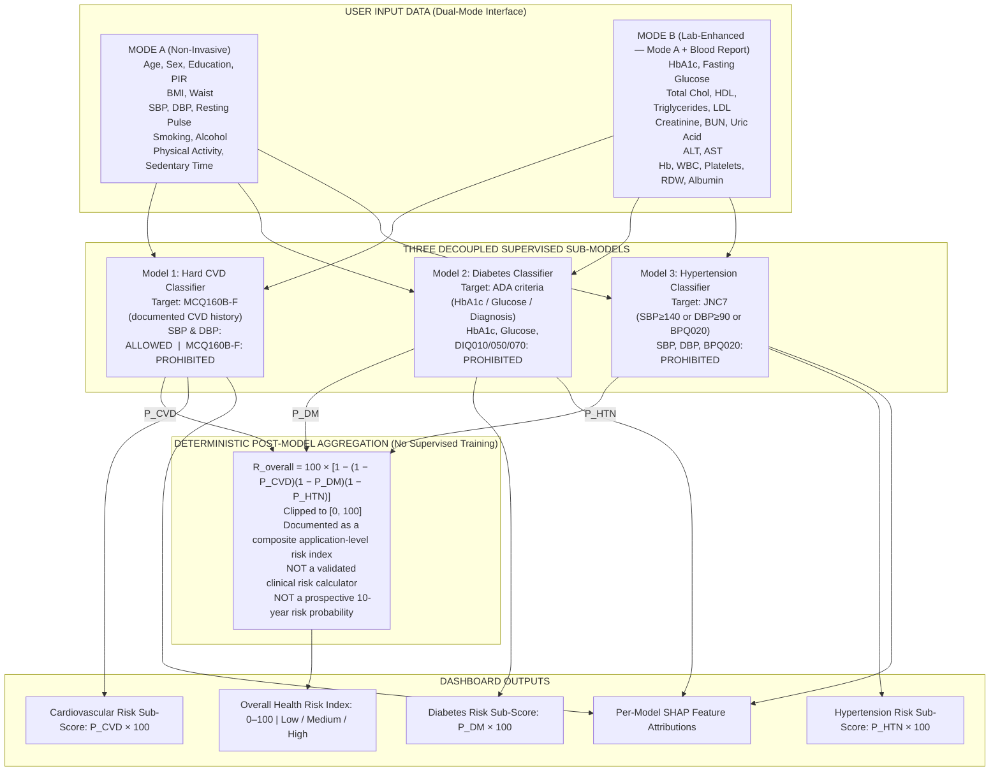
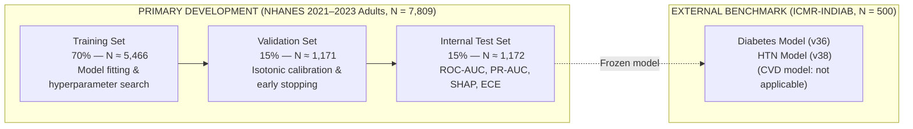

# AI Health Risk Scoring System — Model V2 Architecture Design (Final, Revision 2)

> **Document Type:** Technical Architecture & Feature Specification
> **Stage:** Stage 1B Final — Target & Feature Architecture Design
> **Project:** Final-Year B.Tech CSE Project — *AI Health Risk Scoring System*
> **Primary Development Dataset:** CDC NHANES August 2021–August 2023 (N = 11,933 total; N = 7,809 adults aged 20+)
> **External Validation Dataset:** ICMR-INDIAB Cohort Sample (N = 500 adults)
> **Legacy Baseline:** Synthetic 151-row dataset (`dataset/indian_health_risk_dataset.csv`)
> **Date:** September 2026
> **Status:** Design Finalised — Pending Stage 1C Implementation

---

## 1. Final 3-Model Architecture

### 1.1 Rejection of Circular Composite Supervised Target

Earlier draft iterations proposed a single supervised model trained against a manually constructed composite label:

> Target_Composite = Hard CVD **OR** Diabetes **OR** (SBP ≥ 140) **OR** (DBP ≥ 90) **OR** (Total Cholesterol ≥ 240)

This design was **rejected and removed** for the following reasons:

- **Circular target leakage:** SBP, DBP, HbA1c, fasting glucose, and total cholesterol appear in both the target construction rule and the intended predictor set. A decision tree trained on this label would trivially split on the defining threshold values, producing artificially inflated training metrics that do not generalise.
- **No clinical validity:** The composite is a manually assembled rule, not a clinically validated outcome. Training a supervised model to learn it is equivalent to learning a clinical rule that the developers themselves invented — it produces an appearance of prediction without genuine epidemiological basis.
- **This target has been completely removed from the architecture.** No fourth model, no "Master Composite Estimator", and no supervised model with this composite label exists in Model V2.

### 1.2 Rejection of Undefined Biomarker / Cardiorenal Engine

Earlier drafts proposed a supplementary "Cardiorenal / Biomarker Engine" with a target variously described as "renal or inflammatory stress." This target was **rejected and removed** because:

- No clean, clinically defensible NHANES outcome variable was identified that maps unambiguously to this concept.
- Possession of renal or inflammatory biomarkers (creatinine, BUN, uric acid, WBC, RDW, hemoglobin) is not a sufficient reason to create a supervised model — a defensible outcome label must exist.
- These biomarkers are retained as **predictor candidates** for the three approved sub-models where they are not target-defining.

### 1.3 Approved Final Architecture: Three Decoupled Zero-Leakage Sub-Models

Model V2 is built around **three independent supervised sub-models**, each with a clinically defensible NHANES outcome variable as its target, and each with a strictly controlled predictor set that excludes every variable involved in its own target definition.

The final 0–100 overall health risk score is produced by a **deterministic post-model aggregation layer** — not by a fourth supervised model.



---

## 2. Exact Target Definitions & Cohort Prevalence

All targets are evaluated on the adult population (**N = 7,809 adults aged 20+**) in NHANES 2021–2023.

### 2.1 Model 1 Target: Hard Cardiovascular Disease (Documented History)

**Target construction:**

$$\text{Target}_{\text{CVD}} = 1 \iff (\text{MCQ160B} = 1) \lor (\text{MCQ160C} = 1) \lor (\text{MCQ160D} = 1) \lor (\text{MCQ160E} = 1) \lor (\text{MCQ160F} = 1)$$

**NHANES variables used to construct this target:**

| Variable | Question (NHANES L) | Condition |
|---|---|---|
| `MCQ160B` | Ever told you had congestive heart failure? | = 1 (Yes) |
| `MCQ160C` | Ever told you had coronary heart disease? | = 1 (Yes) |
| `MCQ160D` | Ever told you had angina pectoris? | = 1 (Yes) |
| `MCQ160E` | Ever told you had heart attack/MI? | = 1 (Yes) |
| `MCQ160F` | Ever told you had a stroke? | = 1 (Yes) |

**Cohort prevalence (adults 20+, N = 7,809):**

| Class | N | % |
|---|---|---|
| Positive (Hard CVD history) | 982 | 12.58% |
| Negative | 6,782 | 86.85% |
| Missing / Unknown | 45 | 0.58% |

**Scientific framing:**

The calibrated model probability provides an interpretable estimate of the likelihood of the observed CVD-history outcome within the NHANES 2021–2023 study population, given the participant's demographic, lifestyle, and physiological profile. This is a cross-sectional prevalence estimate and **must not** be described as a prospective 10-year CVD incidence probability, nor as equivalent to Framingham Risk Score, ASCVD, or any other longitudinal clinical risk calculator.

---

### 2.2 Model 2 Target: Diabetes Mellitus (ADA Multi-Criteria Definition)

**Target construction:**

$$\text{Target}_{\text{DM}} = 1 \iff (\text{LBXGH} \ge 6.5) \lor (\text{LBXGLU} \ge 126) \lor (\text{DIQ010} = 1) \lor (\text{DIQ050} = 1) \lor (\text{DIQ070} = 1)$$

**NHANES variables used to construct this target:**

| Variable | Question / Lab | Threshold | Source File |
|---|---|---|---|
| `LBXGH` | HbA1c % | ≥ 6.5% | `GHB_L.xpt` |
| `LBXGLU` | Fasting plasma glucose (mg/dL) | ≥ 126 mg/dL | `GLU_L.xpt` |
| `DIQ010` | Ever told you have diabetes? | = 1 (Yes) | `DIQ_L.xpt` |
| `DIQ050` | Currently taking insulin? | = 1 (Yes) | `DIQ_L.xpt` |
| `DIQ070` | Currently taking diabetes pills? | = 1 (Yes) | `DIQ_L.xpt` |

**Explicit predictor exclusions for Model 2:**

All five target-defining variables (`LBXGH`, `LBXGLU`, `DIQ010`, `DIQ050`, `DIQ070`) are **strictly prohibited** as predictors in the Diabetes model. They may not appear in any feature set passed to the Diabetes model, regardless of Mode A or Mode B input tier.

**Cohort prevalence (adults 20+, N = 7,809):**

| Class | N | % |
|---|---|---|
| Positive (Diabetes by ADA criteria) | 1,385 | 17.74% |
| Negative | 6,424 | 82.26% |
| Missing / Unknown | 0 | 0.00% (100% evaluable) |

**Scientific framing:**

The calibrated model probability provides an interpretable estimate of the likelihood that a participant meets ADA criteria for diabetes, based on their non-glycemic clinical profile. This is a cross-sectional classification and must not be described as a prospective diabetes incidence probability.

---

### 2.3 Model 3 Target: Hypertension (JNC7-Defined)

**Target definition:** This model uses the **JNC 7 (Seventh Report of the Joint National Committee)** definition of hypertension, which classifies hypertension as SBP ≥ 140 mmHg **or** DBP ≥ 90 mmHg **or** a prior physician diagnosis of hypertension.

This is **not** the stricter ACC/AHA 2017 guideline (which lowers the threshold to SBP ≥ 130 or DBP ≥ 80), nor is it restricted to "Stage-2 hypertension" specifically. The JNC7 definition captures the full clinically diagnosed and measured hypertension population.

**Target construction:**

$$\text{Target}_{\text{HTN}} = 1 \iff (\bar{\text{SBP}} \ge 140) \lor (\bar{\text{DBP}} \ge 90) \lor (\text{BPQ020} = 1)$$

where $\bar{\text{SBP}}$ and $\bar{\text{DBP}}$ are the **means of up to three valid oscillometric readings** from `BPXOSY1`/`BPXOSY2`/`BPXOSY3` and `BPXODI1`/`BPXODI2`/`BPXODI3` respectively.

**NHANES variables used to construct this target:**

| Variable | Description | Threshold | Source File |
|---|---|---|---|
| `BPXOSY1..3` (mean) | Mean systolic BP (mmHg) | ≥ 140 | `BPXO_L.xpt` |
| `BPXODI1..3` (mean) | Mean diastolic BP (mmHg) | ≥ 90 | `BPXO_L.xpt` |
| `BPQ020` | Told by doctor you have high blood pressure? | = 1 (Yes) | `BPQ_L.xpt` |

**Explicit predictor exclusions for Model 3:**

`BPXOSY` (systolic), `BPXODI` (diastolic), and `BPQ020` (diagnosis) are **strictly prohibited** as predictors in the Hypertension model. SBP and DBP values from the user's input are not forwarded to this model's feature pipeline, even in Mode A or Mode B.

**Cohort prevalence (adults 20+, N = 7,809):**

| Class | N | % |
|---|---|---|
| Positive (JNC7 hypertension) | 3,331 | 42.66% |
| Negative | 4,469 | 57.22% |
| Missing / Unknown | 9 | 0.12% |

**Scientific framing:**

The calibrated model probability provides an interpretable estimate of the likelihood that a participant meets JNC7 hypertension criteria, based on their non-blood-pressure clinical profile. This is a cross-sectional classification and must not be described as a prospective hypertension incidence probability.

---

## 3. Predictor Sets & Per-Model Leakage Matrix

To guarantee zero circular leakage, predictor availability is strictly enforced per sub-model. The table below documents every feature's status in each model context.

```
======================================================================================================================
FEATURE LEAKAGE MATRIX — MODEL V2 (FINAL)
======================================================================================================================
Feature Name                    | NHANES Variable       | Mode  | CVD Model   | DM Model    | HTN Model
-------------------------------|----------------------|-------|-------------|-------------|------------------
Age                             | RIDAGEYR             | A & B | ALLOWED     | ALLOWED     | ALLOWED
Sex                             | RIAGENDR             | A & B | ALLOWED     | ALLOWED     | ALLOWED
Education Level                 | DMDEDUC2             | A & B | ALLOWED     | ALLOWED     | ALLOWED
Poverty-Income Ratio (PIR)      | INDFMPIR             | A & B | ALLOWED     | ALLOWED     | ALLOWED
BMI                             | BMXBMI               | A & B | ALLOWED     | ALLOWED     | ALLOWED
Waist Circumference             | BMXWAIST             | A & B | ALLOWED     | ALLOWED     | ALLOWED
Systolic BP (mean)              | BPXOSY1..3           | A & B | ALLOWED     | ALLOWED     | PROHIBITED (*)
Diastolic BP (mean)             | BPXODI1..3           | A & B | ALLOWED     | ALLOWED     | PROHIBITED (*)
Resting Pulse (mean)            | BPXOPLS1..3          | A & B | ALLOWED     | ALLOWED     | ALLOWED
Smoking Status                  | SMQ020 / SMQ040      | A & B | ALLOWED     | ALLOWED     | ALLOWED
Alcohol Consumption             | ALQ121 / ALQ111      | A & B | ALLOWED     | ALLOWED     | ALLOWED
Physical Activity Level         | PAD790Q / PAD810Q    | A & B | ALLOWED     | ALLOWED     | ALLOWED
Sedentary Minutes               | PAD680               | A & B | ALLOWED     | ALLOWED     | ALLOWED
-------------------------------|----------------------|-------|-------------|-------------|------------------
HbA1c %                         | LBXGH                | B     | ALLOWED     | PROHIBITED (*) | ALLOWED
Fasting Glucose                 | LBXGLU               | B     | ALLOWED     | PROHIBITED (*) | ALLOWED
Total Cholesterol               | LBXTC                | B     | ALLOWED     | ALLOWED     | ALLOWED
HDL-Cholesterol                 | LBDHDD               | B     | ALLOWED     | ALLOWED     | ALLOWED
Triglycerides                   | LBXTLG               | B     | ALLOWED     | ALLOWED     | ALLOWED
LDL-Cholesterol (calc.)         | LBDLDL               | B     | ALLOWED     | ALLOWED     | ALLOWED
Serum Creatinine                | LBXSCR               | B     | ALLOWED     | ALLOWED     | ALLOWED
Blood Urea Nitrogen             | LBXSBU               | B     | ALLOWED     | ALLOWED     | ALLOWED
Serum Uric Acid                 | LBXSUA               | B     | ALLOWED     | ALLOWED     | ALLOWED
ALT Enzyme                      | LBXSATSI             | B     | ALLOWED     | ALLOWED     | ALLOWED
AST Enzyme                      | LBXSASSI             | B     | ALLOWED     | ALLOWED     | ALLOWED
Hemoglobin                      | LBXHGB               | B     | ALLOWED     | ALLOWED     | ALLOWED
WBC Count                       | LBXWBCSI             | B     | ALLOWED     | ALLOWED     | ALLOWED
Platelet Count                  | LBXPLTSI             | B     | ALLOWED     | ALLOWED     | ALLOWED
RDW %                           | LBXRDW               | B     | ALLOWED     | ALLOWED     | ALLOWED
Serum Albumin                   | LBXSAL               | B     | ALLOWED     | ALLOWED     | ALLOWED
-------------------------------|----------------------|-------|-------------|-------------|------------------
CHF Diagnosis (MCQ160B)         | MCQ160B              | TARGET| PROHIBITED (*) | not used | not used
CHD Diagnosis (MCQ160C)         | MCQ160C              | TARGET| PROHIBITED (*) | not used | not used
Angina Diagnosis (MCQ160D)      | MCQ160D              | TARGET| PROHIBITED (*) | not used | not used
MI / Heart Attack (MCQ160E)     | MCQ160E              | TARGET| PROHIBITED (*) | not used | not used
Stroke Diagnosis (MCQ160F)      | MCQ160F              | TARGET| PROHIBITED (*) | not used | not used
Diabetes Diagnosis (DIQ010)     | DIQ010               | TARGET| not used    | PROHIBITED (*) | not used
Insulin Use (DIQ050)            | DIQ050               | TARGET| not used    | PROHIBITED (*) | not used
Diabetes Pills (DIQ070)         | DIQ070               | TARGET| not used    | PROHIBITED (*) | not used
HTN Diagnosis (BPQ020)          | BPQ020               | TARGET| not used    | not used    | PROHIBITED (*)
Cholesterol Meds (BPQ101D)      | BPQ101D              | EXCL. | PROHIBITED  | PROHIBITED  | PROHIBITED
======================================================================================================================
(*) = Defines or directly proxies for target. Hard prohibition in all pipeline stages.
Note: "not used" means the variable is neither a target nor a predictor for that model; it is unused.
======================================================================================================================
```

---

## 4. Mode A Feature Set (13 Non-Invasive Features)

Mode A is the default, non-invasive input pathway. It requires no blood test report and is collected through the application's health questionnaire.

| # | Feature Name | NHANES Variable | Source File | Type | Coverage | HTN Model |
|---|---|---|---|---|---|---|
| 1 | Age (years) | `RIDAGEYR` | `DEMO_L.xpt` | Numeric | 100.0% | ALLOWED |
| 2 | Sex | `RIAGENDR` | `DEMO_L.xpt` | Categorical | 100.0% | ALLOWED |
| 3 | Education Level | `DMDEDUC2` | `DEMO_L.xpt` | Categorical | 99.9% | ALLOWED |
| 4 | Poverty-Income Ratio | `INDFMPIR` | `DEMO_L.xpt` | Numeric | 85.9% | ALLOWED |
| 5 | BMI (kg/m²) | `BMXBMI` | `BMX_L.xpt` | Numeric | 76.5% | ALLOWED |
| 6 | Waist Circumference (cm) | `BMXWAIST` | `BMX_L.xpt` | Numeric | 73.8% | ALLOWED |
| 7 | Mean Systolic BP (mmHg) | `BPXOSY1..3` | `BPXO_L.xpt` | Numeric | 72.4% | **PROHIBITED** |
| 8 | Mean Diastolic BP (mmHg) | `BPXODI1..3` | `BPXO_L.xpt` | Numeric | 72.4% | **PROHIBITED** |
| 9 | Resting Pulse (bpm) | `BPXOPLS1..3` | `BPXO_L.xpt` | Numeric | 72.4% | ALLOWED |
| 10 | Smoking Status | `SMQ020`/`040` | `SMQ_L.xpt` | Categorical | 88.7% | ALLOWED |
| 11 | Alcohol Consumption | `ALQ121`/`111` | `ALQ_L.xpt` | Categorical | 81.9% | ALLOWED |
| 12 | Physical Activity Level | `PAD790Q`/`810Q` | `PAQ_L.xpt` | Categorical | 89.1% | ALLOWED |
| 13 | Sedentary Minutes/Day | `PAD680` | `PAQ_L.xpt` | Numeric | 88.9% | ALLOWED |

> [!IMPORTANT]
> SBP and DBP (features 7–8) are collected in the UI for Mode A but are **routed away from the HTN model pipeline**. They are forwarded only to the CVD and Diabetes model pipelines. The HTN model receives features 1–6, 9–13 in Mode A.

---

## 5. Mode B Feature Set (Mode A + 16 Laboratory Biomarkers = 29 Features)

Mode B is the lab-enhanced input pathway, activated when the user manually enters laboratory values or uploads a clinical blood test report.

| # | Feature Name | NHANES Variable | Source File | Panel | Coverage | DM Model |
|---|---|---|---|---|---|---|
| 14 | HbA1c % | `LBXGH` | `GHB_L.xpt` | Glycemic | 70.4% | **PROHIBITED** |
| 15 | Fasting Glucose (mg/dL) | `LBXGLU` | `GLU_L.xpt` | Glycemic | 41.1% (subsample) | **PROHIBITED** |
| 16 | Total Cholesterol (mg/dL) | `LBXTC` | `TCHOL_L.xpt` | Lipid | 70.4% | ALLOWED |
| 17 | HDL-Cholesterol (mg/dL) | `LBDHDD` | `HDL_L.xpt` | Lipid | 70.4% | ALLOWED |
| 18 | Triglycerides (mg/dL) | `LBXTLG` | `TRIGLY_L.xpt` | Lipid | 41.1% (subsample) | ALLOWED |
| 19 | LDL-Cholesterol (mg/dL) | `LBDLDL` | `TRIGLY_L.xpt` | Lipid | 40.6% (subsample) | ALLOWED |
| 20 | Serum Creatinine (mg/dL) | `LBXSCR` | `BIOPRO_L.xpt` | Renal | 70.4% | ALLOWED |
| 21 | BUN (mg/dL) | `LBXSBU` | `BIOPRO_L.xpt` | Renal | 70.4% | ALLOWED |
| 22 | Serum Uric Acid (mg/dL) | `LBXSUA` | `BIOPRO_L.xpt` | Metabolic | 70.4% | ALLOWED |
| 23 | ALT (U/L) | `LBXSATSI` | `BIOPRO_L.xpt` | Hepatic | 70.4% | ALLOWED |
| 24 | AST (U/L) | `LBXSASSI` | `BIOPRO_L.xpt` | Hepatic | 70.4% | ALLOWED |
| 25 | Hemoglobin (g/dL) | `LBXHGB` | `CBC_L.xpt` | CBC | 73.1% | ALLOWED |
| 26 | WBC Count (10³/µL) | `LBXWBCSI` | `CBC_L.xpt` | CBC | 73.1% | ALLOWED |
| 27 | Platelet Count (10³/µL) | `LBXPLTSI` | `CBC_L.xpt` | CBC | 73.1% | ALLOWED |
| 28 | RDW % | `LBXRDW` | `CBC_L.xpt` | CBC | 73.1% | ALLOWED |
| 29 | Serum Albumin (g/dL) | `LBXSAL` | `BIOPRO_L.xpt` | Metabolic | 70.4% | ALLOWED |

> [!IMPORTANT]
> HbA1c (feature 14) and Fasting Glucose (feature 15) are available in Mode B but are **prohibited predictors in the Diabetes model only** — they define the Diabetes target. They are valid predictors for the CVD and HTN models. A feature being in Mode B does not override the per-model leakage prohibition.

---

## 6. Overall Health Risk Score — Deterministic Aggregation

> [!IMPORTANT]
> The Overall Health Risk Score is **not produced by a supervised ML model**. It is produced by a deterministic mathematical formula applied to the calibrated outputs of the three sub-models. No training is performed on the composite score itself.

### 6.1 Aggregation Formula

$$P_{\text{CVD}}, \quad P_{\text{DM}}, \quad P_{\text{HTN}} \in [0, 1]$$

where each probability is the Platt / Isotonic-calibrated output from its respective zero-leakage sub-model.

$$R_{\text{overall}} = 1 - \left(1 - P_{\text{CVD}}\right) \times \left(1 - P_{\text{DM}}\right) \times \left(1 - P_{\text{HTN}}\right)$$

$$\text{Overall Health Risk Index} = \min\!\left(100,\; \max\!\left(0,\; R_{\text{overall}} \times 100\right)\right)$$

This formula treats the three conditions as probabilistically independent (a simplifying assumption that will be documented on the dashboard) and computes the probability that the user falls into at least one of the three risk groups.

### 6.2 Risk Tier Thresholds

| Tier | Score Range | Interpretation |
|---|---|---|
| **Low** | 0 – 29 | Low estimated composite cardiometabolic risk |
| **Medium** | 30 – 59 | Moderate estimated composite cardiometabolic risk |
| **High** | 60 – 100 | High estimated composite cardiometabolic risk |

### 6.3 Dashboard Display Outputs

The user dashboard will display:

| Output | Value | Source |
|---|---|---|
| Overall Health Risk Index | 0 – 100 (Low / Medium / High) | Deterministic aggregation |
| Cardiovascular Risk Sub-Score | $P_{\text{CVD}} \times 100$ | CVD model output |
| Diabetes Risk Sub-Score | $P_{\text{DM}} \times 100$ | Diabetes model output |
| Hypertension Risk Sub-Score | $P_{\text{HTN}} \times 100$ | HTN model output |
| SHAP Feature Attributions | Per-model explanations | SHAP TreeExplainer |

### 6.4 Mandatory Disclaimer Language

The dashboard and any exported reports **must** include the following (or equivalent) disclaimer:

> *The Overall Health Risk Index is a composite application-level risk index derived from three independent machine-learning sub-models trained on cross-sectional survey data (CDC NHANES 2021–2023). It is not a clinically validated risk calculator, not a prospective 10-year disease incidence probability, and not equivalent to Framingham Risk Score, ASCVD, or any other validated clinical risk tool. It is intended for informational and educational purposes only and must not be used to make or defer medical decisions.*

---

## 7. Calibration Strategy

Each sub-model's raw predicted probability is calibrated before use in the aggregation formula.

| Step | Method | When Applied |
|---|---|---|
| **Primary calibration** | Isotonic Regression (non-parametric, monotone) | On the held-out validation set (15% split) |
| **Fallback calibration** | Platt Scaling (logistic calibration) | If Isotonic overfits on small positive classes |
| **Evaluation** | Reliability diagram (calibration curve) + Expected Calibration Error (ECE) | Reported for each sub-model |
| **Survey weight application** | `WTMEC2YR` weights applied during calibration | Post-hoc; not applied during tree model training |

> [!NOTE]
> Survey weights are applied during the calibration step (not during tree model training) to anchor the model's population-level probability estimates toward CDC-representative NHANES prevalence rates.

---

## 8. ICMR-INDIAB External Validation Strategy

### 8.1 Scope of External Validation

The ICMR-INDIAB sample (`backend/ml/data/raw/icmr_indiab/sample.dta`, N = 500 adults) is used **strictly as an external benchmark** — it plays no role in model training, hyperparameter search, calibration, or internal test evaluation.

**Compatible validation targets (ICMR sample contains):**

| NHANES Model | ICMR Equivalent Variable | Definition Match |
|---|---|---|
| Diabetes (Model 2) | `v36` (Diabetes flag) | Self-reported diagnosis; comparable to `DIQ010`. HbA1c/glucose-based sub-criteria not available. |
| Hypertension (Model 3) | `v38` (Hypertension flag) | Self-reported diagnosis; BP measurement cut-offs not separately available. Partial match. |
| — | `v40` (Generalised Obesity) | Not a model target, but useful for BMI/waist distribution comparison. |
| — | `v41` (Dyslipidemia) | Not a model target, but relevant for lipid predictor distribution comparison. |

**CVD Model external validation:** The ICMR sample **does not** contain an individual hard CVD history equivalent (`v35` records family history of heart disease, not personal diagnosis). **No external validation of the CVD model will be claimed on the ICMR sample.** The CVD model's performance is reported only on the internal NHANES test set.

### 8.2 Indian-Specific Clinical Cut-offs (Applied at Evaluation Time)

| Feature | Standard NHANES Threshold | Indian / South Asian Threshold | Application |
|---|---|---|---|
| BMI | ≥ 30 kg/m² (WHO General Obesity) | ≥ 25 kg/m² (Asian Obesity) | `asian_obesity_flag` derived feature at ICMR evaluation |
| Waist (Men) | ≥ 102 cm | ≥ 90 cm | `south_asian_waist_flag` derived feature |
| Waist (Women) | ≥ 88 cm | ≥ 80 cm | `south_asian_waist_flag` derived feature |

These derived flags supplement the continuous BMI and waist predictors. They are applied during ICMR evaluation only; the NHANES training pipeline uses continuous values.

### 8.3 Definition Difference Documentation

Any metric comparison between NHANES-trained model predictions and ICMR outcome flags will document the following definition differences:

- NHANES diabetes target uses ADA lab criteria (HbA1c, fasting glucose) + self-report; ICMR `v36` is self-report only.
- NHANES hypertension target uses measured BP thresholds (SBP ≥ 140 or DBP ≥ 90) + self-report; ICMR `v38` is self-report only.
- Any AUC or calibration metrics computed on ICMR are labelled as "approximate external benchmarks" due to definition mismatch.

---

## 9. Survey-Weight Strategy

> [!NOTE]
> Survey weights are **not implemented** in Stage 1B or Stage 1C data preparation. This section documents the intended methodological approach for Stage 2 (model training).

| Task | Weight Variable | Strategy |
|---|---|---|
| Model training (tree models) | None | Unweighted; stratified cross-validation prevents high-weight outlier distortion |
| Probability calibration | `WTMEC2YR` (2-year MEC examination weight) | Applied during Isotonic Regression calibration to anchor predicted probabilities to CDC-representative national prevalence |
| Fasting sub-cohort analysis | `WTSAF2YR` or `WTPH2YR` (to be confirmed) | Applicable only to Fasting Glucose and Triglycerides analysis |
| Prevalence reporting | `WTMEC2YR` | Weighted prevalence figures for the final report and dashboard |

**Items to verify in Stage 1C / Stage 2:**

- Confirm the exact CDC variable name for NHANES 2021–2023 fasting examination weights (`WTSAF2YR` vs `WTPH2YR`) against official documentation.
- Verify whether combining 2021–2023 2-year weights with any cross-cycle pooling requires rescaling.

---

## 10. Cross-Sectional Data Limitation

> [!IMPORTANT]
> **This is a methodological constraint that must be disclosed in all output interfaces.**

NHANES 2021–2023 is a **cross-sectional survey**. Each participant was measured at a single point in time. The dataset records the presence or absence of disease history at that moment — it does not follow participants forward in time.

Consequences for Model V2:

| What the model estimates | What it does NOT estimate |
|---|---|
| Probability of observed CVD history in a cross-sectional NHANES-like population | Probability of developing CVD over the next 10 years |
| Probability of meeting ADA diabetes criteria at time of assessment | Probability of incident diabetes diagnosis over any future time horizon |
| Probability of meeting JNC7 hypertension criteria at time of assessment | Probability of developing hypertension over any future time horizon |

**Language rule:** All model output descriptions use the phrase "estimated likelihood of the observed condition" or "estimated risk profile" — never "10-year risk", "incidence probability", or "prospective risk prediction".

---

## 11. Blood-Test Integration Implications

### 11.1 Why Mode B Exists

Mode B supports users who already possess routine blood test results (CBC, lipid panel, metabolic panel, HbA1c). Including lab biomarkers substantially improves predictive accuracy for all three sub-models, particularly:

- **CVD model:** HbA1c, total cholesterol, HDL, triglycerides, and creatinine are clinically established CVD risk factors.
- **Diabetes model:** Lipids (especially triglycerides), renal markers (creatinine, BUN), liver enzymes (ALT, AST), and CBC markers (hemoglobin, WBC) are associated with insulin resistance and metabolic syndrome without directly defining the diabetes target.
- **HTN model:** Uric acid, creatinine, albumin, and cholesterol are associated with hypertension-related end-organ damage and metabolic risk.

### 11.2 Biomarker Routing Rules

A Mode B biomarker that **defines** a particular model's target must be **excluded** from that model's feature pipeline, even though it appears in the user's blood test report. The routing logic is:

```
Blood test report → Feature router:
  HbA1c, Fasting Glucose → CVD model ✓ | Diabetes model ✗ | HTN model ✓
  SBP, DBP              → CVD model ✓ | Diabetes model ✓  | HTN model ✗
  All other biomarkers   → All three models ✓
```

### 11.3 Missingness Handling for Lab Features

Fasting biomarkers (Fasting Glucose, Triglycerides, LDL) are present in only ~41% of the NHANES adult sample due to CDC randomised fasting sub-sampling. In Stage 1C, missing lab values will be handled via:

- **IterativeImputer (MICE)** for laboratory continuous variables (Tier 1: total cholesterol, HDL, creatinine, BUN, hemoglobin, WBC).
- **Median imputation** for fasting-subsample variables (Tier 2: Fasting Glucose, Triglycerides, LDL) as a fallback where MICE produces unstable estimates on small sub-cohorts.
- **Missing-indicator flags** added alongside imputed values for Tier 2 variables to allow models to learn from the absence pattern.

The imputation strategy will be validated programmatically in Stage 1C before use in training.

---

## 12. Data Split Strategy



- **Stratification:** Stratified simultaneously by age group (20–39 / 40–59 / 60+), sex, and each target outcome variable.
- **Patient independence:** Each NHANES respondent has a unique `SEQN`; zero overlap across splits.
- **ICMR isolation:** The ICMR sample has no contact with any training or calibration step; it is a read-once final benchmark.

---

## 13. Remaining Methodological Questions for Stage 1C

The following items must be resolved programmatically during Stage 1C before data preparation and training begin. No assumption should be committed to code until verified.

- [ ] **Fasting weight variable name:** Confirm whether `WTSAF2YR` or `WTPH2YR` is the correct CDC variable name for NHANES August 2021–August 2023 fasting examination weights. Verify against the official `DEMO_L` codebook.
- [ ] **SAS floating-point epsilon handling:** Confirm exact recoding of SAS floating-point underflow epsilons ($\approx 5.3976 \times 10^{-79}$) to `0.0` in all NHANES XPT numeric fields.
- [ ] **Imputation strategy validation:** Run comparative missingness imputation trials (IterativeImputer vs. Median) on Mode B laboratory features using the NHANES training split; select strategy based on reconstruction error.
- [ ] **Hyperparameter search grids:** Finalise candidate search grids for Random Forest, XGBoost, and LightGBM for each sub-model; confirm whether nested cross-validation or a simple train/validation/test split is used.
- [ ] **Resting pulse availability:** Verify that `BPXOPLS` (pulse rate) is reliably present in `BPXO_L.xpt` for the August 2021–August 2023 cycle; confirm column name (some NHANES cycles use `BPXPLS`).
- [ ] **Alcohol variable mapping:** Confirm which of `ALQ121` (past-12-month drinking days) vs `ALQ111` (ever drank alcohol) best represents a 3-tier current/former/never categorical.
- [ ] **Asian obesity flag:** Confirm that derived feature `asian_obesity_flag` (BMI ≥ 25) is computed at feature-engineering time (not training time) to prevent data leakage in imputation pipelines.
- [ ] **ICMR definition mismatch documentation:** Formally document all NHANES-to-ICMR variable definition mismatches in a mapping table before reporting any external validation metrics.

---

*Machine-readable feature specification:*
[`model_v2_feature_matrix.csv`](file:///c:/Users/sunny/Desktop/AI-Health-Risk-Scoring-System/backend/ml/data/interim/audit/model_v2_feature_matrix.csv)

*Data audit foundation:*
[`DATA_AUDIT_REPORT.md`](file:///c:/Users/sunny/Desktop/AI-Health-Risk-Scoring-System/backend/ml/data/DATA_AUDIT_REPORT.md)
