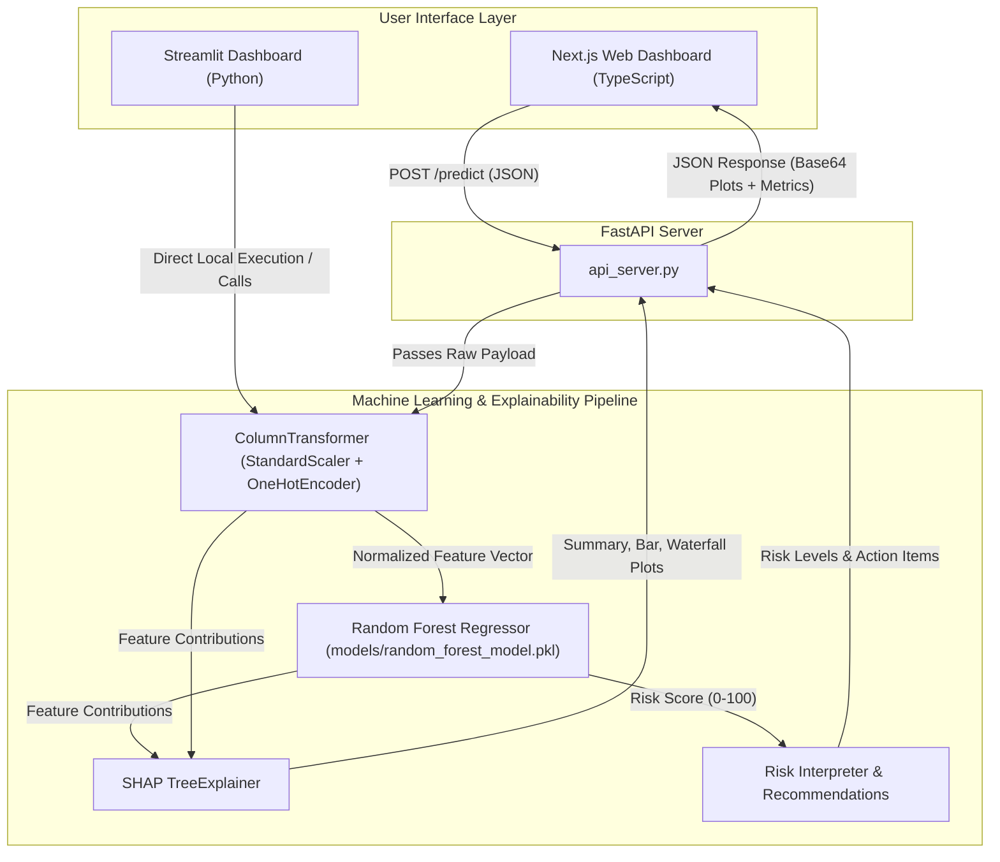

# AI Health Risk Scoring System — Project Summary & Architecture

This document provides a comprehensive overview of the architecture, data pipeline, API contracts, and user interfaces of the **Sensor-Augmented Personalized Health Risk Scoring Using Explainable Machine Learning** project.

---

## 1. Project Purpose & Objective

The primary purpose of this project is to provide a predictive and interpretable system for health risk assessment. By integrating clinical, lifestyle, and physiological parameters (such as Heart Rate Variability metrics SDNN and RMSSD), the system:
* Predicts a personalized, numeric health risk score in the `0–100` range.
* Classifies the score into three risk levels: **Low**, **Medium**, or **High**.
* Utilizes **SHAP (SHapley Additive exPlanations)** to dissect the exact factors contributing to each prediction, showing both risk-promoting (+) and risk-reducing (-) factors.
* Generates actionable, personalized lifestyle and clinical recommendations based on user inputs.

---

## 2. Directory Structure

```text
AI-Health-Risk-Scoring-System/
│
├── app/                        # Next.js Frontend Application (TypeScript + React)
│   ├── globals.css             # Glassmorphic and modern UI styles
│   ├── layout.tsx              # Root Next.js layout configuration
│   └── page.tsx                # Interactive dashboard React page
│
├── dataset/                    # Dataset directory
│   └── indian_health_risk_dataset.csv  # Synthetic Indian health dataset
│
├── docs/                       # Project documentation
│   ├── Dataset and Feature Engineering.md
│   ├── Frontend and DemoFlow.md
│   ├── Functional Requirement and System Design Document,.md
│   ├── ML and SHAP Explainability.md
│   ├── Phasewise Execution.md
│   └── project_summary.md      # This file
│
├── models/                     # Serialized ML model binaries
│   └── random_forest_model.pkl # Trained Random Forest Regressor Pipeline
│
├── outputs/                    # Local script outputs
│   ├── predictions.csv         # Predicted output from CLI run
│   ├── risk_interpretations.txt# Explanation summary text file
│   └── shap_{summary/bar/waterfall}_plot.png  # Generated SHAP charts
│
├── src/                        # Modular Python ML & Utility Pipeline
│   ├── data_loader.py          # Data ingestion utilities
│   ├── feature_engineering.py   # Selects features and defines target
│   ├── predict.py              # Runs pipeline predictions
│   ├── preprocessing.py        # Pipelines for numeric scaling and categorical encoding
│   ├── risk_interpreter.py     # Categorization and explanation formatter
│   ├── shap_explainer.py       # Interfacing with SHAP TreeExplainer
│   ├── train_model.py          # Random Forest training and evaluation logic
│   ├── utils.py                # Directory & IO helper functions
│   └── visualization.py        # SHAP plot rendering to files
│
├── api_server.py               # FastAPI backend server exposing predictions
├── app.py                      # Streamlit dashboard & WSGI entry point
├── main.py                     # CLI wrapper for testing the ML pipeline
├── package.json                # Next.js configurations
└── requirements.txt            # Python dependencies (scikit-learn, fastapi, shap, streamlit)
```

---

## 3. High-Level Architecture & Workflow

The workflow of the project connects user inputs to machine learning models, explains them using game theory (SHAP), and presents the final results to the user.



---

## 4. Frontend Implementation (Dual Frontend Option)

The system is uniquely designed with **two optional frontends** depending on the run configuration:

### A. Next.js Web App (`/app/page.tsx`)
A production-ready Web App designed with a modern, glassmorphic layout using vanilla CSS.
* **Input Interface**: Forms split into Demographics, Lifestyle, Clinical Indicators (BMI, BP, Cholesterol), and Physiological Metrics (including sensor metrics SpO2, Heart Rate, and HRV values: SDNN, RMSSD).
* **Presets**: Offers instant presets ("High Risk Sample" and "Low Risk Sample") for rapid demo testing.
* **API Integration**: Performs real-time API calls to the FastAPI backend, dynamically rendering results and base64-encoded SHAP plots without page reloads.

### B. Streamlit Application (`/app.py`)
A Python-only, low-code interface built with Streamlit, styled with custom injected CSS to mimic the Next.js dark-mode visual hierarchy.
* Imports `src/` modules directly to execute predictions locally or can serve as the FastAPI host.
* Renders interactive input sliders/forms and handles SHAP plot display using native Matplotlib output in Python.

---

## 5. Backend API & Contracts (`api_server.py`)

The backend is built with FastAPI. It handles CORS for frontend communication and exposes prediction and explainability features.

### POST `/predict`
Accepts a structured JSON payload containing user features, runs preprocessing, evaluates predictions via the Random Forest model, calculates local SHAP explanations, and returns metrics along with three dynamically generated charts in base64 format.

#### Request Schema
```json
{
  "age": 55,
  "gender": "Male",
  "bmi": 31.0,
  "systolic_bp": 145,
  "diastolic_bp": 92,
  "cholesterol_mg_dl": 250,
  "smoking": "Yes",
  "alcohol_consumption": "Yes",
  "physical_activity": "Low",
  "family_history": "Yes",
  "heart_rate_bpm": 92,
  "sdnn_hrv": 35.0,
  "rmssd_hrv": 28.0,
  "spo2": 94.0
}
```

#### Response Schema
```json
{
  "risk_score": 82.45,
  "risk_level": "High Risk",
  "positive_contributors": [
    { "feature": "cholesterol_mg_dl", "value": 12.35 },
    { "feature": "smoking", "value": 8.14 }
  ],
  "negative_contributors": [
    { "feature": "physical_activity", "value": -4.20 }
  ],
  "insights": [
    "Cholesterol Mg Dl is increasing the predicted risk.",
    "Smoking is increasing the predicted risk.",
    "Physical Activity is helping reduce the predicted risk."
  ],
  "recommendations": [
    "Reduce or stop smoking to lower cardiovascular risk.",
    "Aim for gradual weight reduction with balanced nutrition.",
    "Reduce saturated fats and monitor cholesterol levels.",
    "Monitor blood pressure and limit excess sodium.",
    "Add at least 30 minutes of moderate activity most days.",
    "Consult a healthcare professional for a detailed checkup."
  ],
  "summary_plot": "iVBORw0KGgoAAAAN...", // Base64 encoded PNG
  "bar_plot": "iVBORw0KGgoAAAAN...",     // Base64 encoded PNG
  "waterfall_plot": "iVBORw0KGgoAAAAN..."// Base64 encoded PNG
}
```

---

## 6. Machine Learning & Preprocessing Pipeline (`src/`)

### A. Preprocessing Pipeline (`src/preprocessing.py`)
All inputs are transformed using a scikit-learn `ColumnTransformer`:
* **Categorical Data** (`gender`, `smoking`, `alcohol_consumption`, `physical_activity`, `family_history`):
  * Normalized to uniform capitalization (`Yes` / `No`).
  * Imputed with `most_frequent` using `SimpleImputer`.
  * One-Hot Encoded via `OneHotEncoder(handle_unknown="ignore")`.
* **Numeric Data** (`age`, `bmi`, `systolic_bp`, `diastolic_bp`, etc.):
  * Forced to numeric values.
  * Imputed with `median` using `SimpleImputer`.
  * Scaled to mean=0 and variance=1 via `StandardScaler`.

### B. Prediction and Classification (`src/risk_interpreter.py`)
Risk scores are mapped to risk bands:
* **`0` to `34`**: Low Risk
* **`35` to `69`**: Medium Risk
* **`70` to `100`**: High Risk

### C. SHAP Explainability Layer (`src/shap_explainer.py`)
* Instantiates a `shap.TreeExplainer` on the trained Random Forest model.
* Calculates SHAP values for the scaled and encoded feature space.
* Resolves feature names back to readable descriptors to construct waterfall plots mapping individual parameter impacts (e.g. how a BMI of 31.0 increases the risk by `+X` units relative to the baseline population risk).

---

## 7. Mock vs. Real API Calls

* **Mock Presets (Client-Side)**: To allow users to instantly test the system, the Next.js frontend defines pre-configured JSON templates representing healthy (Low Risk) and unhealthy (High Risk) lifestyle profiles. Clicking these presets updates the form values.
* **Real API Executions**: There are **no mocked predictions**. Every submit action:
  1. Serializes the current form values into a real JSON payload.
  2. Makes an HTTP POST request to the FastAPI server at `/predict`.
  3. The FastAPI server processes the input in real-time using the actual trained Random Forest pipeline (`models/random_forest_model.pkl`).
  4. The TreeExplainer computes exact SHAP values for this specific input.
  5. Backend generates Matplotlib graphs, converts them to base64, and returns the response.
  6. The frontend renders these real plots and predictions.
